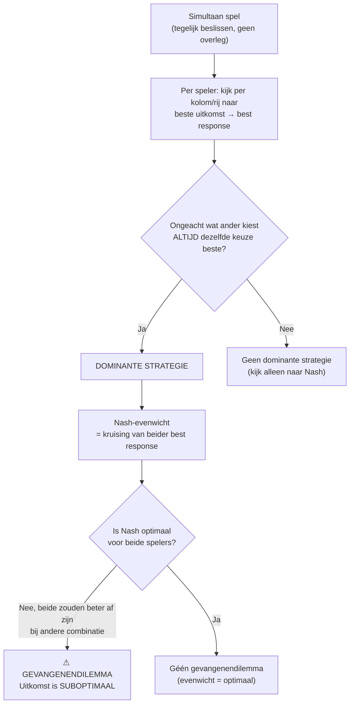
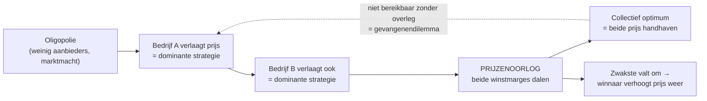
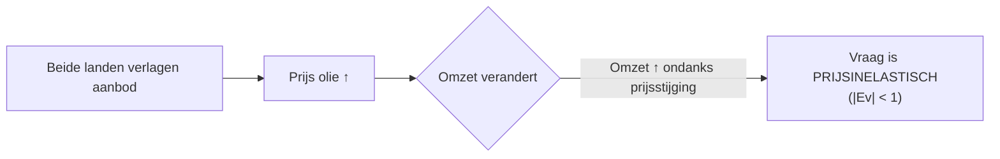
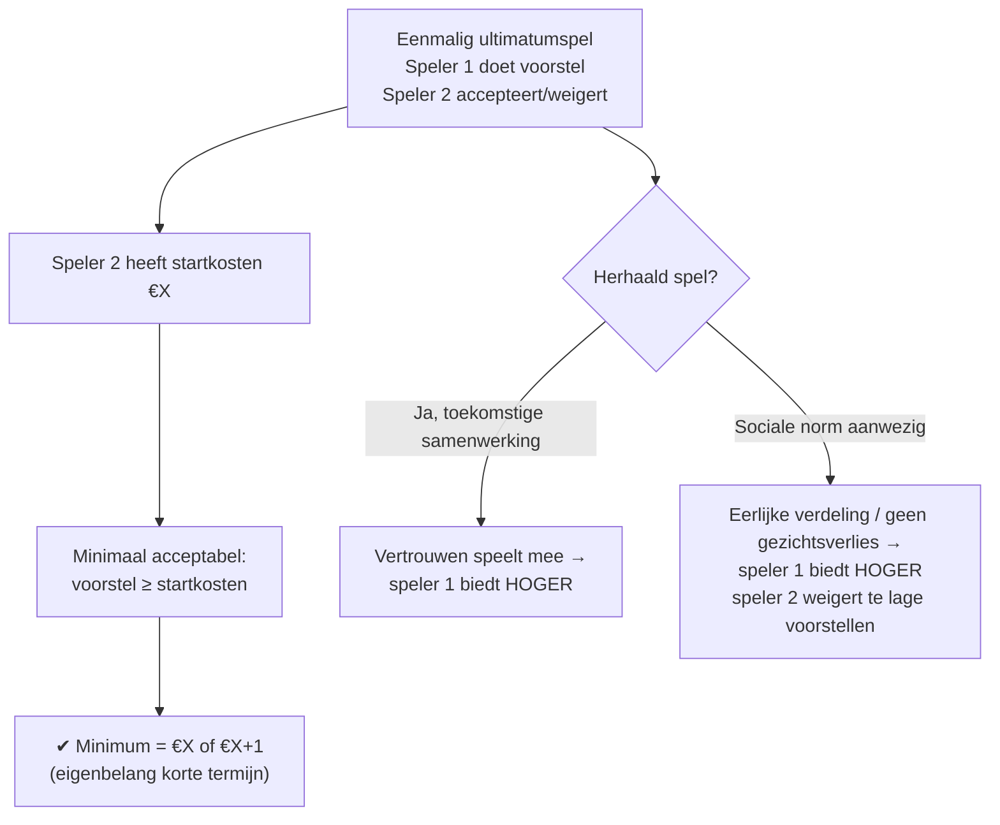
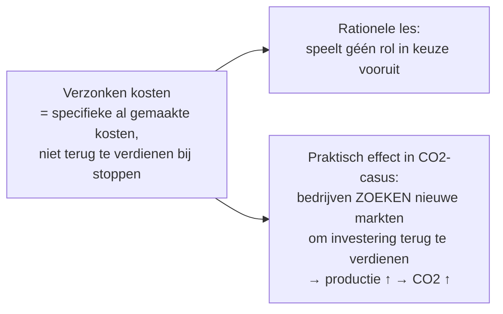
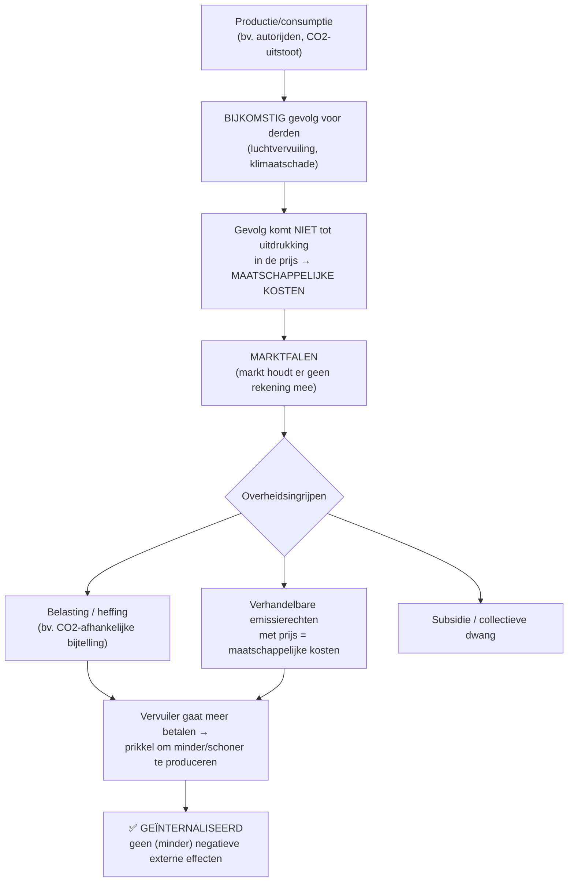
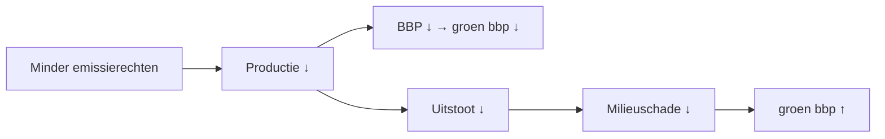
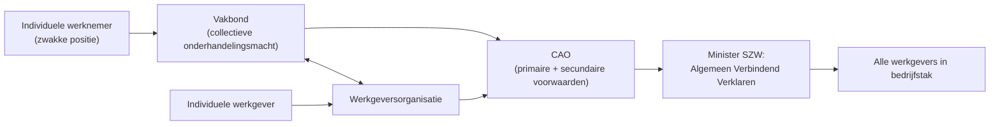

# 🎯 Logica-Dashboard · Hoofdstuk 1 — Samenwerken is een spel

> Visueel dashboard per paragraaf. Focus op **causale ketens** (Mermaid) en **score-termen** (exact de woorden uit de correctievoorschriften 2023-2025). Onderaan: welke examenvragen je oefent per paragraaf.

---

## § 1.1 · Speltheorie · Nash & Gevangenendilemma

### Causale keten — van dominante strategie naar gevangenendilemma

### 🔑 Dikgedrukte score-termen

- **Simultaan spel** · beide spelers beslissen tegelijk, geen overleg.
- **Dominante strategie** · "de keuze die een partij maakt, **ongeacht** de keuze die de ander maakt".
- **Best response-methode** · per kolom het beste voor rijspeler arceren; per rij het beste voor kolomspeler.
- **Nash-evenwicht** · combinatie van strategieën waarbij **geen van de spelers een reden heeft om van strategie te veranderen**.
- **Gevangenendilemma** · situatie waarin een evenwicht ontstaat waarbij de uitkomst **voor beiden niet optimaal** is.

### ✍️ Examen-formulering (letterlijk goed gerekend in CV)

> "De dominante strategie voor X is Y, want **ongeacht wat** de tegenpartij kiest, de uitkomst is het **minst negatief / het meest positief** als X kiest voor Y."
>
> "Het resultaat (Y, Y) is **suboptimaal voor beide**, want **beider individuele resultaten zouden beter zijn** als beide kiezen voor Z (en dus er is sprake van een **gevangenendilemma**)."

### ⚠️ Check: géén gevangenendilemma

Als beide partijen een dominante strategie hebben, maar de uitkomst is al **optimaal voor beiden tegelijk** → géén gevangenendilemma (zie 2025 v16).

---

## § 1.2 · Prijzenoorlog & Oligopolie

### Causale keten — prijzenoorlog als gevangenendilemma

### 🔑 Kenmerken oligopolie (score-termen CV 2023 v21)

| Kenmerk | Examenzin |
|---|---|
| Beperkt aantal aanbieders | "Er is sprake van een **beperkt aantal aanbieders**." |
| Toetredingsbarrières | "Er zijn **toetredingsbarrières** (beschikking over [specifieke input] is voorwaardelijk voor toetreding)." |
| Marktmacht | "Er is sprake van **marktmacht** (dit blijkt uit het gegeven dat er concurrentiestrijd is om marktaandeel)." |

### ⚠️ Let op — prijsafspraken vs. prijzenoorlog

- **Prijzenoorlog** = toegestaan.
- **Prijsafspraken** tussen concurrenten = **verboden** (Mededingingswet / kartelverbod).

### Olie-voorbeeld (2023): prijsinelastische vraag

> Economische logica: bij **prijsinelastische vraag** → prijsstijging leidt tot omzetstijging; bij **prijselastische vraag** → prijsstijging leidt tot omzetdaling.

---

## § 1.3 · Onderhandelen, Ultimatumspel & Sociale normen

### Causale keten — minimum-acceptatie in een eenmalig spel

### 🔑 Score-termen (CV 2024 v25-27)

- **Ultimatumspel-minimum** · "De aannemer zal een verdeling accepteren waarmee de **eigen startkosten worden terugverdiend**." → antwoord: `€ 25.000 / € 25.001`.
- **Herhaald spel** · "**Vertrouwen (in een gunstige toekomstige samenwerking)** speelt een rol" → speler 1 stelt **hoger bedrag** voor.
- **Sociale norm** · voorbeeld: "**gelijke verdeling bij gelijke prestatie**" of "**eerlijke verdeling**".
- Effect sociale norm op gedrag: speler 2 **weigert een (te laag) bedrag dat niet voldoet aan de sociale norm**; speler 1 biedt hoger **om gezichtsverlies in de sociale omgeving te voorkomen**.

### Verzonken kosten · dubbele rol

### Zelfbinding vs. contract vs. sociale norm

| Instrument | Werking | Geloofwaardigheidsbron |
|---|---|---|
| **Contract** | Juridisch bindend, boete bij verbreken | Wet / rechter |
| **Sociale norm** | Reputatie, gezichtsverlies | Sociale omgeving |
| **Zelfbinding** | Eenzijdig onomkeerbaar maken | Zichtbaarheid + onomkeerbaarheid |

---

## § 1.4 · Externe effecten & Internalisatie

### Causale keten — van negatief extern effect naar internalisering

### 🔑 Score-termen — negatief extern effect (CV 2023 v13 + 2025 v15/v20)

- **Negatief extern effect** · "de vervuiling **komt niet tot uitdrukking in de prijs** van [het product]".
- **Maatschappelijke kosten** · "dit leidt tot **maatschappelijke kosten**".
- **Prijsmechanisme als prikkel** · "de vervuiler gaat **meer betalen voor meer CO₂-uitstoot** → consument wordt **gestimuleerd** om [minder vervuilend alternatief] te kiezen".
- **Internalisatie** · "Hierdoor wordt de vervuiling **geïnternaliseerd** en is er sprake van **minder negatieve externe effecten**" / "de **vervuiler gaat er zelf voor betalen**. Er zijn dan **geen negatieve externe effecten meer**."
- **Emissierechten** · kopen → kosten ↑ → prikkel om **duurzamer / schoner / minder te produceren**; verkopen → opbrengst ↑ → duurzaam produceren **aantrekkelijker**.

### Groen bbp — twee tegengestelde effecten bij minder emissierechten (CV 2025 v19)

---

## § 1.5 · Arbeidsmarkt · CAO · EU · MVO

*In de examens 2023-2025 is géén directe vraag gesteld over CAO / vakbond / EU-structuur / MVO. Kerntheorie voor SE en eventuele examenvraagstukken staat in de volledige samenvatting. Onderstaand dashboard blijft relevant voor begrippen.*

### Causale keten — CAO als oplossing voor gevangenendilemma op arbeidsmarkt

### Kernbegrippen

- **Primaire arbeidsvoorwaarden** · loon + werktijden.
- **Secundaire arbeidsvoorwaarden** · vakantie, pensioen, ziekteuitkering, opleiding.
- **CAO** · collectieve afspraken per bedrijfstak tussen vakbonden en werkgeversorganisaties.
- **EU / EMU** · 27 landen; gezamenlijk monetair beleid & euro.
- **MVO / 3 P's** · People, Planet, Profit.
- **Circulaire economie** · producten en materialen behouden waarde door hergebruik.

---

## 📝 Geselecteerde examenvragen per paragraaf

| § | Thema | Jaar · Opg. · Vraag | Punten |
|---|---|---|---|
| **1.1** | Dominante strategie & gevangenendilemma | **2023 · Opg. 5 · v22** | 2p |
| **1.1** | Dominante strategie & géén gevangenendilemma | **2025 · Opg. 3 · v16** | 2p |
| **1.2** | Marktvraag verandering → prijs | **2023 · Opg. 5 · v20** | 1p |
| **1.2** | Oligopolie + 2 kenmerken | **2023 · Opg. 5 · v21** | 2p |
| **1.3** | Ultimatumspel — minimale acceptatie | **2024 · Opg. 6 · v25** | 2p |
| **1.3** | Herhaald spel & vertrouwen | **2024 · Opg. 6 · v26** | 2p |
| **1.3** | Sociale norm beïnvloedt gedrag | **2024 · Opg. 6 · v27** | 2p |
| **1.3** | Verzonken kosten → zoektocht nieuwe markten | **2025 · Opg. 3 · v17** | 2p |
| **1.4** | Fiscale bijtelling → negatief extern effect terugdringen | **2023 · Opg. 3 · v13** | 2p |
| **1.4** | Emissierechten prikkelen tot minder CO₂ | **2025 · Opg. 3 · v15** | 1p |
| **1.4** | Internalisering: prijs = maatschappelijke kosten | **2025 · Opg. 3 · v20** | 1p |

**Totaal: 11 vragen · 20 punten**

---

> 📂 Voor de interactieve oefening: open `Examen_Engine_H1.html` in je browser. Vraag + volledig antwoordmodel (puntenverdeling 1-op-1 uit het officiële correctievoorschrift) staan daar inklapbaar.
