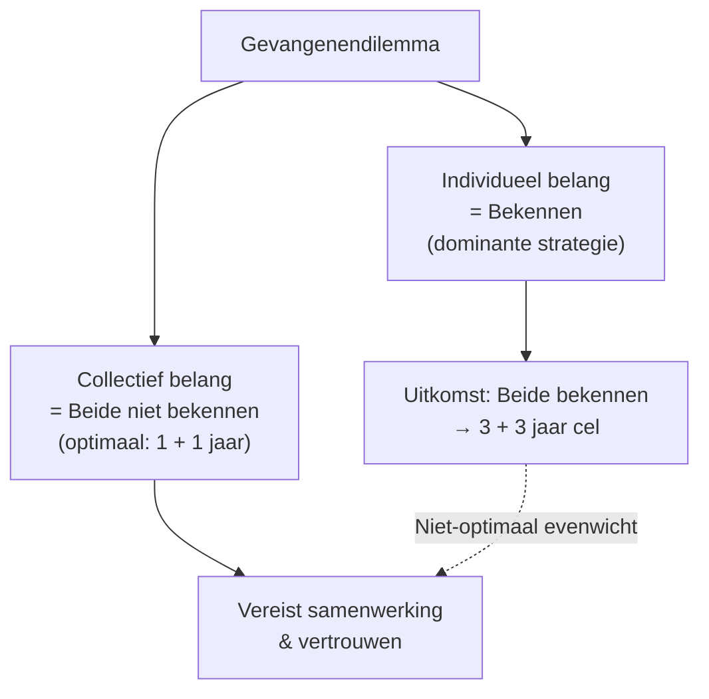
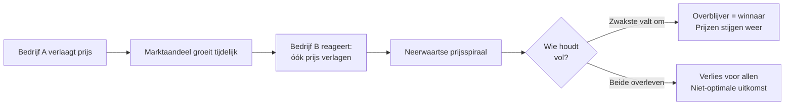
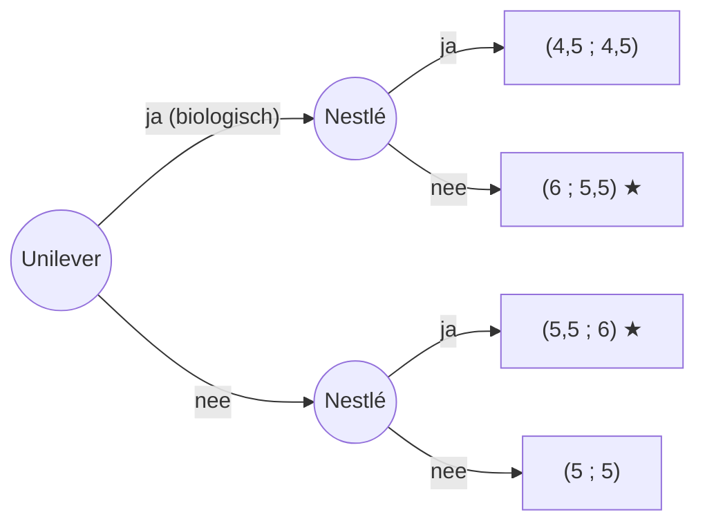

# Hoofdstuk 1 — Samenwerken is een spel
### Samenvatting Paragraaf 1.1, 1.2 en 1.3

---

## 1.1 Speltheorie

### Wat is speltheorie?

**[Invalshoek: De Markt / Overheid]**

- **Speltheorie** = het bestuderen van de manier waarop mensen beslissingen nemen waarbij ze rekening houden met de keuzes van anderen.
- Uitgangspunt: spelers (consumenten, bedrijven, overheid) beslissen **rationeel** (met het verstand, zonder emotie).
- In de praktijk is menselijk gedrag vaak onvoorspelbaarder dan de theorie.

> **Economische logica:** Als jouw beste keuze afhangt van wat de ander doet, zit je in een "spel". Je móet dus vooraf nadenken over de strategie van je tegenspeler.

### Soorten spellen (3 dimensies)

| Dimensie | Type A | Type B |
|---|---|---|
| **Tijd** | **Simultaan** – spelers beslissen tegelijk | **Sequentieel (dynamisch)** – speler 1 kiest eerst, speler 2 reageert |
| **Herhaling** | **Eenmalig** – één ronde | **Herhaald** – acties in vorige rondes beïnvloeden strategie |
| **Samenwerking** | **Coöperatief** – spelers stemmen strategieën af | **Niet-coöperatief** – iedereen kiest voor eigen belang |

> **Ezelsbruggetje:** *"Tegelijk of om de beurt?"*, *"Eén keer of vaker?"*, *"Samen of solo?"*

---

### De opbrengstenmatrix (pay-off matrix)

**[Invalshoek: De Producent]**

- **Opbrengstenmatrix** = tabel met alle mogelijke uitkomsten van een spel, per combinatie van strategieën.
- **Rijspeler** staat links (getal vóór de komma), **kolomspeler** staat boven (getal ná de komma).
- Notatie: `(uitkomst speler 1, uitkomst speler 2)`.

**Voorbeeld: Bibi (rij) vs. Stefan (kolom) – wel/geen trouwfoto's**

|  | **Stefan: Wel trouwfoto's** | **Stefan: Geen trouwfoto's** |
|---|---|---|
| **Bibi: Wel trouwfoto's** | (–1.000 ; 0) | (2.000 ; –500) |
| **Bibi: Geen trouwfoto's** | (1.000 ; 3.000) | (0 ; 0) |

---

### De best response-methode → Nash-evenwicht

**Stappenplan (altijd zo toepassen op het examen!):**

1. **Rijspeler** bekijkt per kolom (= elke keuze van tegenspeler) wat zijn beste uitkomst is → **arceer** dat getal voor de komma.
2. **Kolomspeler** bekijkt per rij wat zijn beste uitkomst is → **arceer** dat getal na de komma.
3. Is een vakje waarin **beide getallen zijn gearceerd**? → Dat is een **Nash-evenwicht**.

**Definitie Nash-evenwicht**
> Een combinatie van strategieën waarbij **geen van de spelers een reden heeft om van strategie te veranderen**, gegeven de strategie van de ander.

Toegepast op het voorbeeld → Nash = **(Bibi: Geen trouwfoto's ; Stefan: Wel trouwfoto's) = (1.000 ; 3.000)**.

---

### Gevangenendilemma (prisoners' dilemma)

**[Invalshoek: De Markt / Overheid]**

Een **gevangenendilemma** is een simultaan spel waarin een evenwicht ontstaat dat voor **beide spelers niet optimaal** is.

**Voorwaarden (leer ze uit je hoofd!):**
- Beslissen tegelijkertijd.
- Beslissingen onafhankelijk; uitkomst afhankelijk van elkaar.
- Eenmalige beslissing.
- Zelfde informatie voor beide spelers.
- Kiezen voor eigen belang.
- Keuze uit twee alternatieven.
- Geen overleg mogelijk.

**Standaardmatrix — Jesse vs. Finn (straf in jaren cel):**

|  | **Finn: Bekennen** | **Finn: Niet bekennen** |
|---|---|---|
| **Jesse: Bekennen** | (3 ; 3) | (vrij ; 5) |
| **Jesse: Niet bekennen** | (5 ; vrij) | (1 ; 1) |

> **Economische logica:** Iedereen kiest rationeel voor zichzelf → de groep als geheel komt slechter uit. Precies waarom overheden soms mogen ingrijpen (kartelverbod, milieuregels, etc.).

---

### Dominante strategie vs. individueel/collectief belang

| Begrip | Definitie | Voorbeeld |
|---|---|---|
| **Dominante strategie** | Speler kiest **altijd dezelfde strategie**, ongeacht wat de ander doet | "Bekennen" bij gevangenendilemma |
| **Individueel belang** | Uitkomst die voor hém het gunstigst is | Beide supermarkten: prijsverlaging |
| **Collectief/Gezamenlijk belang** | Strategie met de **hoogste gezamenlijke opbrengst** | Beide supermarkten: prijzen gelijk houden |

> **Economische toepassing:** Bij een gevangenendilemma zoeken spelers naar de oplossing die hen als groep beter maakt. Dat lukt alleen met overleg, contract of herhaald spel.

---

## 1.2 Strategie in een prijzenoorlog

### Individueel vs. collectief belang opnieuw

**[Invalshoek: De Producent]**

- **Collectief belang** = het belang van alle spelers samen; leidt tot de optimale uitkomst voor iedereen.
- Bij een simultaan spel kun je niet overleggen → je kiest vaak je dominante strategie.
- In de praktijk wél overleg mogelijk → ruimte voor coöperatief gedrag.

### Nul-som-spel vs. niet-nul-som-spel

| Type spel | Kenmerk | Voorbeeld |
|---|---|---|
| **Nul-som-spel** | Uitkomst heeft een **constante waarde**. Wat de één wint, verliest de ander. (1–0, ½–½, 0–1) | Schaakpartij, poker |
| **Niet-nul-som-spel** | Combinatie van strategieën waarbij **beide** winst óf **beide** verlies kunnen hebben | Gevangenendilemma, prijzenoorlog |

> **Economische logica:** Bij een niet-nul-som-spel is **samenwerken** zinvol – want de totale "taart" kan groter (of kleiner) worden. Bij een nul-som-spel heeft samenwerken geen zin.

---

### Prijzenoorlog

**[Invalshoek: De Producent]**

**Prijzenoorlog** = situatie waarin concurrenten elkaar bestrijden met **prijsverlagingen** om marktaandeel te vergroten of concurrenten uit de markt te drukken.

**Redenen om een prijzenoorlog te starten:**
- Vergroten van **afzet/omzet** en **marktaandeel**.
- Concurrent uit de markt duwen → later alleenheerser (monopolie) worden.

**Risico's voor producenten:**
- Verlagen winstmarges voor de hele branche.
- Verlies kan jaren duren.
- Product kan goedkoper/slechter van kwaliteit worden.

**Risico's voor consumenten:**
- Korte termijn: **voordelig** (lagere prijs).
- Lange termijn: prijsverhogingen nadat concurrent is verdwenen; mindere kwaliteit.

**Waar vinden prijzenoorlogen vooral plaats?**
- **Oligopolistische markten** (enkele grote aanbieders): telecom, supermarkten, tankstations, autofabrikanten, zorgverzekeraars.

> **Economische logica:** Een prijzenoorlog is vaak een gevangenendilemma op bedrijfsniveau. Individueel belang (prijs verlagen) leidt tot een collectief slechter resultaat.

---

### Voorbeeld prijzenoorlog – restaurants T en S

|  | **S: Meedoen** | **S: Niet meedoen** |
|---|---|---|
| **T: Meedoen** | (€ 1.425 ; € 1.920) | (€ 1.995 ; € 1.200) |
| **T: Niet meedoen** | (€ 996 ; € 2.400) | (€ 1.660 ; € 2.100) |

→ **Dominante strategie** voor beide = meedoen met kortingsactie.
→ **Collectieve optimum** = beide niet meedoen (€ 1.660 + € 2.100 > € 1.425 + € 1.920).
→ Dit is een **gevangenendilemma in de praktijk**.

---

## 1.3 Onderhandelen en samenwerken

### Van simultaan naar sequentieel

**[Invalshoek: De Consument & Producent]**

- Bij **sequentieel spel** volgen beslissingen elkaar op → de latere speler heeft **meer informatie**.
- Oorspronkelijk "beste" keuze kan hierdoor veranderen.

---

### Ultimatumspel

- **Ultimatumspel** = sequentieel spel met **slechts één beslisser (speler 1)** die een voorstel doet. Speler 2 accepteert of wijst af.
- Bij afwijzing: **beide** krijgen niets.
- Puur rationeel: speler 2 moet élk voorstel > 0 accepteren.
- In de praktijk: **rechtvaardigheidsgevoel** telt mee (bevredigende verdeling ligt rond **€ 30 / € 70**).

> **Economische logica:** Mensen zijn bereid iets op te geven om oneerlijkheid te straffen. Emotie en sociale normen breken met de pure rationele theorie.

---

### Spelboom (beslissingsboom) & Backwards induction

Een **spelboom** visualiseert een sequentieel spel. Notatie uitkomst: `(speler 1 ; speler 2)`.

**Methode**: **Backwards induction** (terugredeneren)
1. Begin bij de **laatste** beslissing.
2. Kies per knoop de beste optie voor de laatst kiezende speler.
3. Werk zo terug naar het begin.

**Voorbeeld: Unilever (eerst) vs. Nestlé (daarna) – wel/niet biologisch produceren (winst × miljard €):**

**Backwards induction:**
- Als Unilever "ja" → Nestlé kiest "nee" (5,5 > 4,5) → uitkomst **(6 ; 5,5)**.
- Als Unilever "nee" → Nestlé kiest "ja" (6 > 5) → uitkomst **(5,5 ; 6)**.
- Unilever kiest wat het meeste oplevert: **6 > 5,5 → "ja"** → evenwicht = **(6 ; 5,5)**.

> **Economische logica:** Wie als **eerste** beweegt, kan een **first-mover-voordeel** pakken door het spel te "dwingen" naar zijn gunstigste uitkomst.

---

### Onderhandelen, contracten en samenwerking

**[Invalshoek: De Markt / Overheid]**

| Instrument | Definitie | Functie |
|---|---|---|
| **Onderhandelen** | Partijen komen via overleg tot afspraak die voor alle partijen acceptabel is | Collectief belang boven eigen belang plaatsen |
| **Contract** | Document waarin gemaakte afspraken **schriftelijk** worden vastgelegd + handtekening | Gevangenendilemma **doorbreken**; boete bij niet-nakoming |
| **Sociale normen** | Ongeschreven regels; reputatie-effect | Alternatief voor contract; werkt vooral bij herhaald spel |
| **Zelfbinding** | Speler maakt eenzijdig een keuze **geloofwaardig onomkeerbaar**, ongeacht keuze tegenspeler | Laat zien dat je je aan je woord houdt |

**Let op – wettelijke grenzen:**
- In Nederland zijn **prijsafspraken** tussen concurrenten **verboden** (mededingingswet).
- **Prijzenoorlog mag wél**, prijsafspraak **niet**.

---

### Zelfbinding – voorbeelden

- **Milieucertificaat**: bedrijf verplicht zich publiekelijk tot CO₂-reductie.
- **Energiemaatschappij** die alléén stroom van windmolens levert.
- **Trouwring**: geloofwaardige zelfbinding aan een partner 😉 (conceptueel).

> **Economische logica:** Zelfbinding werkt pas als het voor de ander **zichtbaar én onomkeerbaar** is. Zonder geloofwaardigheid blijft het loze praat.

---

### Verzonken kosten (sunk costs)

- **Verzonken kosten** = specifieke kosten die al gemaakt zijn en **niet meer ongedaan** kunnen worden gemaakt.
- Voorbeelden: marktonderzoek, ontwikkelingskosten, niet-terugvorderbare concertkaartjes.

> **Economische logica:** Verzonken kosten zijn **geen argument** voor toekomstige beslissingen. Economisch rationeel = kijk vooruit, niet achteruit. In de praktijk laten mensen (en bedrijven) zich tóch vaak leiden door reeds gemaakte kosten ("sunk cost fallacy").

---

## Kernbegrippen – Flashcard-lijst

| Begrip | Korte definitie |
|---|---|
| **Speltheorie** | Studie van beslissingen waarbij je rekening houdt met de keuze van anderen |
| **Simultaan spel** | Spelers beslissen tegelijkertijd |
| **Sequentieel spel** | Spelers beslissen na elkaar |
| **Eenmalig / Herhaald spel** | Eén ronde vs. meerdere rondes met geheugen |
| **Coöperatief spel** | Spelers stemmen strategie op elkaar af |
| **Opbrengstenmatrix** | Tabel met alle mogelijke uitkomsten van een spel |
| **Best response-methode** | Stappenplan om Nash-evenwicht te vinden via arcering |
| **Nash-evenwicht** | Geen speler heeft reden om van strategie te veranderen |
| **Gevangenendilemma** | Simultaan spel met niet-optimale uitkomst voor beide |
| **Dominante strategie** | Altijd dezelfde keuze, ongeacht de ander |
| **Individueel belang** | Eigen beste uitkomst |
| **Collectief belang** | Beste uitkomst voor alle spelers samen |
| **Nul-som-spel** | Winst van één = verlies van de ander (constante som) |
| **Niet-nul-som-spel** | Beide kunnen winnen óf verliezen |
| **Prijzenoorlog** | Concurrenten bestrijden elkaar met prijsverlagingen |
| **Oligopolie** | Markt met enkele grote aanbieders |
| **Ultimatumspel** | Sequentieel: 1 speler doet voorstel, 2 accepteert/weigert |
| **Spelboom** | Visuele boomstructuur van een sequentieel spel |
| **Backwards induction** | Terugredeneren vanaf laatste keuze om evenwicht te vinden |
| **Contract** | Juridisch vastgelegde afspraak met eventuele boete |
| **Sociale normen** | Ongeschreven regels, reputatie-effect |
| **Zelfbinding** | Je keuze geloofwaardig onomkeerbaar maken |
| **Verzonken kosten** | Al gemaakte kosten die niet meer ongedaan kunnen worden |

---

## Examentips

1. **Best-response altijd uitvoeren** met arceringen – schrijf het erbij op je examenblad.
2. **Check alle voorwaarden** voordat je iets een gevangenendilemma noemt.
3. **Bij sequentieel spel** → altijd spelboom tekenen + backwards induction.
4. **Verzonken kosten** zijn een **valkuil**: ze horen níet mee te wegen in toekomstige beslissingen.
5. Let bij vragen over samenwerking altijd op: **contract, sociale norm of zelfbinding?**
