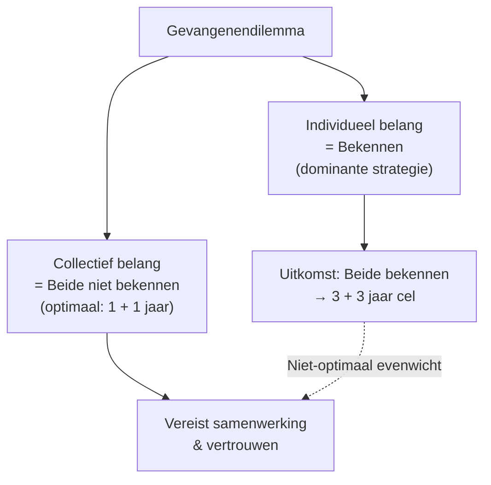
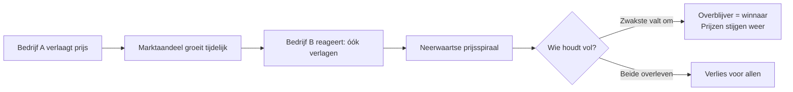
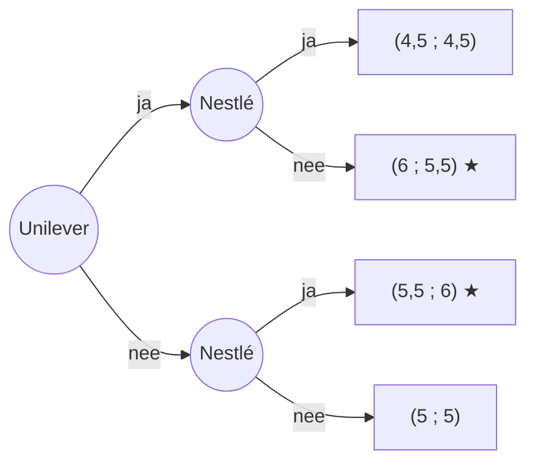
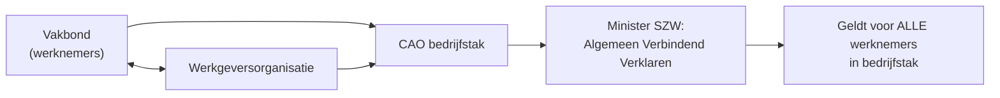
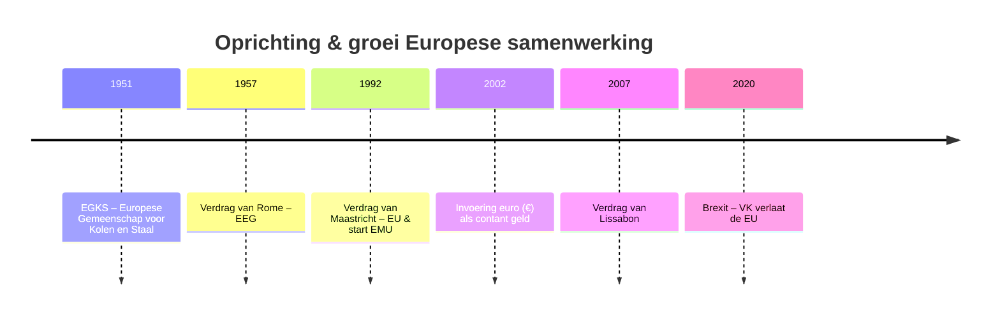
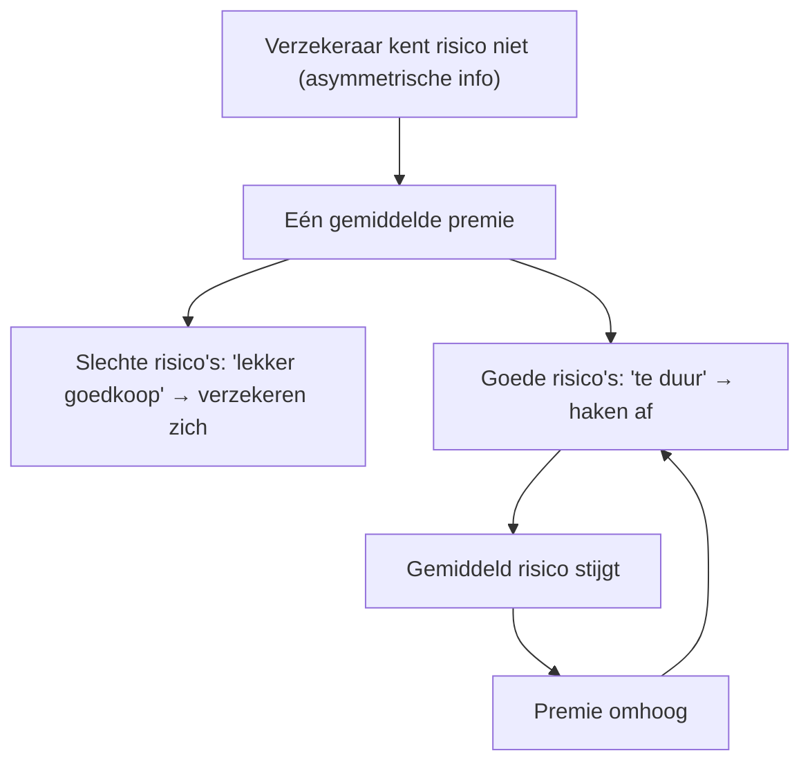
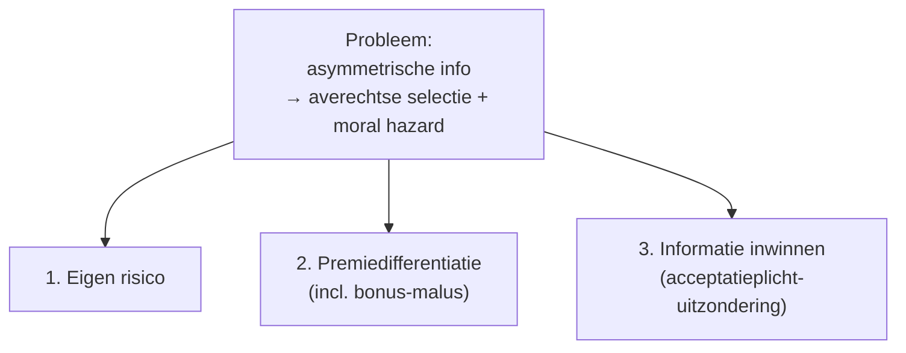
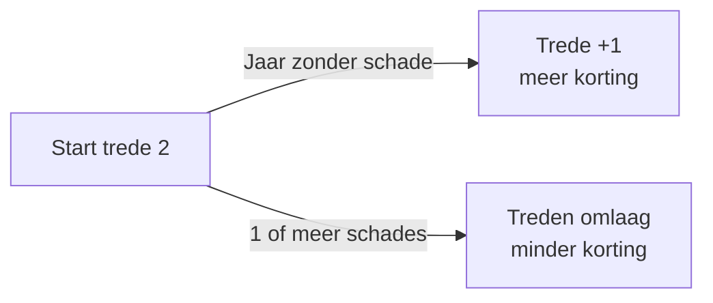
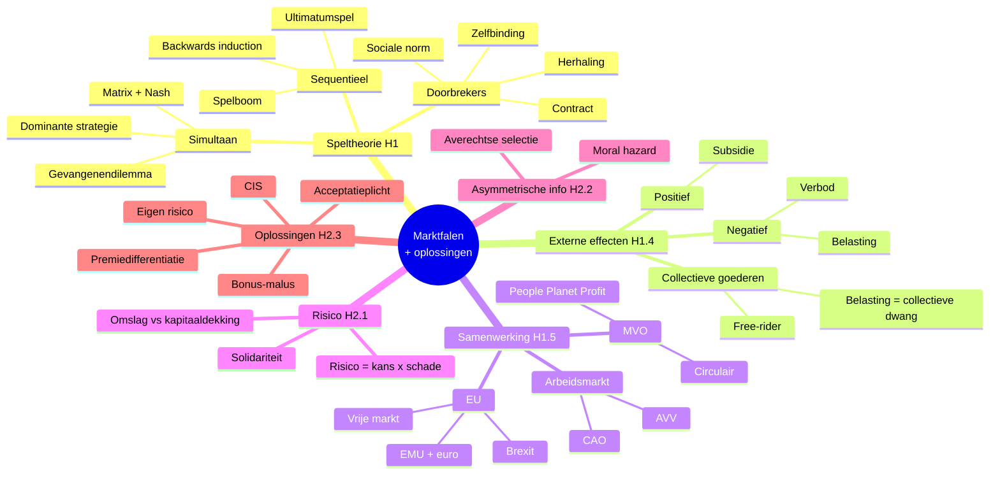
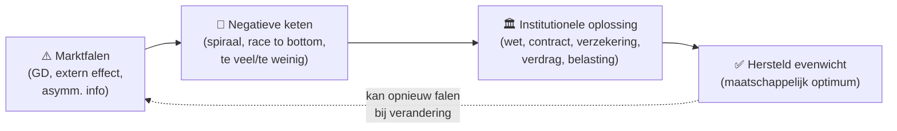

# Volledige Samenvatting – HAVO Economie

## Hoofdstuk 1 · Samenwerken is een spel   |   Hoofdstuk 2 · Risico & Informatie

> Deze samenvatting dekt alle paragrafen (1.1 t/m 1.5 en 2.1 t/m 2.3), plus de begrippenlijsten, formules en EU/MVO-theorie uit de overige bronnen. Print-klaar, B1-niveau, met invalshoeken, tabellen en voorbeelden.

---

## 📖 Leeswijzer – hoe gebruik je dit document?

Dit document is opgebouwd in **drie lagen** per onderwerp. Lees ze altijd in deze volgorde, dan beklijft de stof veel sneller:

| Laag | Symbool | Wat staat er? | Waarom? |
|---|---|---|---|
| **1. Definitie & feiten** | (gewone tekst, tabel) | Begrip + voorbeeld + formule | Examen vraagt vaak letterlijke definitie |
| **2. Causale keten** | 🧠 **Begrijp de Logica** | Stap-voor-stap *waarom* het werkt zoals het werkt | Het examen test of je het mechanisme begrijpt |
| **3. Examenvalkuil** | ⚠️ **Let op** | Veelgemaakte fout / nuance | 1-2 punten extra die anderen verliezen |

### Iconen in dit document

| Icoon | Betekenis |
|---|---|
| 👤 | Invalshoek **Consument** |
| 🏭 | Invalshoek **Producent** |
| 🏛️ | Invalshoek **Markt / Overheid** |
| 🧠 | "Begrijp de Logica" – causale keten |
| ⚠️ | Examenvalkuil / veel-gemaakte fout |
| 🧮 | Rekenformule of -voorbeeld |
| 🔁 | Verband met ander begrip elders in de samenvatting |

```text
┌──────────────┐    ┌──────────────────┐    ┌──────────────┐    ┌──────────────┐
│ 1️⃣ DEFINITIE │ ─▶ │ 2️⃣ BEGRIJP DE   │ ─▶ │ 3️⃣ VALKUIL  │ ─▶ │ 4️⃣ EXAMEN   │
│ wat is het?  │    │    LOGICA 🧠    │    │    ⚠️       │    │ casus       │
│              │    │ WAAROM werkt    │    │ vermijd     │    │ toepassen   │
│              │    │ het zo?         │    │ punt-aftrek │    │             │
└──────────────┘    └──────────────────┘    └──────────────┘    └──────────────┘
```

---

# HOOFDSTUK 1 · SAMENWERKEN IS EEN SPEL

## 1.1 Speltheorie

### Wat is speltheorie?
**[Invalshoek: 🏛️ De Markt / Overheid]**

- **Speltheorie** = theorie over de manier waarop mensen beslissingen nemen, waarbij ze rekening houden met de mogelijke uitkomst van keuzes van anderen.
- Uitgangspunt: spelers (consumenten, bedrijven, overheid) beslissen **rationeel** (met verstand, zonder emotie).
- In de praktijk is menselijk gedrag vaak onvoorspelbaarder dan de theorie.

> 🧠 **Begrijp de Logica – Waarom überhaupt "speltheorie"?**
>
> Bij een gewone vraag/aanbod-markt heb je **veel** anonieme spelers — niemand kan in z'n eentje de prijs beïnvloeden. Maar zodra er **weinig** spelers zijn (oligopolie, twee landen, twee aannemers), wordt jouw winst direct beïnvloed door de keuze van die ander. Dan moet je vooruit-denken:
>
> 1. *"Wat doet hij waarschijnlijk?"*
> 2. *"Wat is mijn beste antwoord daarop?"*
> 3. *"Wist hij dát ik dat zou denken?"*
>
> Speltheorie geeft een **systematische methode** (matrix → best response → Nash) om dit redeneerproces te ordenen, zodat je niet vastloopt in een "ja maar wat als…"-spiraal.

> ⚠️ **Examenvalkuil:** Speltheorie is **rationeel**, maar examenvragen testen vaak het **gat met de praktijk** (rechtvaardigheidsgevoel, vertrouwen, sociale norm). Zie je in de casus woorden als *"in de praktijk"*, *"echte mensen"*, *"sociale norm"* → wijk dan af van de pure rationele uitkomst.

### De 3 dimensies van een spel

| Dimensie | Type A | Type B |
|---|---|---|
| **Tijd** | **Simultaan** – spelers beslissen tegelijk | **Sequentieel** – speler 1 kiest eerst, speler 2 reageert |
| **Herhaling** | **Eenmalig** – één ronde | **Herhaald** – acties in vorige rondes beïnvloeden strategie |
| **Samenwerking** | **Coöperatief** – spelers stemmen strategieën af | **Niet-coöperatief** – iedereen kiest voor eigen belang |

> **Ezelsbruggetje:** *"Tegelijk of om de beurt?"*, *"Eén keer of vaker?"*, *"Samen of solo?"*

> 🧠 **Begrijp de Logica – Waarom maakt elke dimensie uit?**
>
> Elke dimensie bepaalt **welk model je mag gebruiken** en **welke uitkomst rationeel is**:
>
> ```text
>   DIMENSIE              │  TYPE A                    │  TYPE B
> ────────────────────────┼────────────────────────────┼──────────────────────────────
>  ⏱️  Tijd?              │  Simultaan (tegelijk)      │  Sequentieel (om de beurt)
>                         │     ↓                      │     ↓
>                         │  Opbrengsten-MATRIX        │  SPEL-BOOM
>                         │  + best response → Nash    │  + backwards induction
> ────────────────────────┼────────────────────────────┼──────────────────────────────
>  🔁  Hoe vaak?          │  Eenmalig                  │  Herhaald
>                         │     ↓                      │     ↓
>                         │  Eigen belang wint         │  Reputatie + sociale
>                         │  (klassiek GD)             │  norm tellen mee
> ────────────────────────┼────────────────────────────┼──────────────────────────────
>  🤝  Samen mogelijk?    │  Niet-coöperatief          │  Coöperatief
>                         │     ↓                      │     ↓
>                         │  Kartelverbod              │  Contract / CAO /
>                         │  → ieder voor zich         │  EU-verdrag mag
> ```
>
> **Voorbeeldketens:**
> - *Twee aannemers met aanbesteding* (24-2-25) → sequentieel + eenmalig → ultimatumspel.
> - *Twee energiebedrijven over CO₂-rechten* (25-1-16) → simultaan + eenmalig → matrix + Nash.
> - *Twee aannemers vaker samen* (24-2-26) → herhaald → reputatie telt → bod gaat omhoog.

> ⚠️ **Examenvalkuil:** Bij **herhaald** spel is "altijd verraden" niet meer dominant — je verliest reputatie en wordt in toekomstige rondes gestraft. Lees dus altijd of het spel "nog vaker" plaatsvindt.

---

### Opbrengstenmatrix (pay-off matrix)
**[Invalshoek: 🏭 De Producent]**

- **Opbrengstenmatrix** = tabel met de uitkomsten van een spel per combinatie van strategieën.
- **Rijspeler** links (getal vóór de komma), **kolomspeler** boven (getal ná de komma).
- Notatie: `(uitkomst speler 1 ; uitkomst speler 2)`.

**Voorbeeld – Bibi (rij) vs. Stefan (kolom) – wel/geen trouwfoto's:**

|  | **Stefan: Wel** | **Stefan: Geen** |
|---|---|---|
| **Bibi: Wel** | (–1.000 ; 0) | (2.000 ; –500) |
| **Bibi: Geen** | (1.000 ; 3.000) | (0 ; 0) |

> 🧠 **Begrijp de Logica – De matrix is gewoon "alle mogelijke werelden"**
>
> Elk vakje is één scenario "als ík X kies en hij Y, dan…". De matrix dwingt je om **eerst álle scenario's uit te schrijven**, zodat je niet één optie vergeet. Pas daarna ga je kiezen.
>
> **Lees-truc voor de notatie `(a ; b)`:**
> - `a` = winst voor de **rij**speler (links) — zet je vinger op het rij-label en kijk in dezelfde rij.
> - `b` = winst voor de **kolom**speler (boven) — zet je vinger op het kolom-label en kijk in dezelfde kolom.
> - Komma = scheiding, géén minteken.

> ⚠️ **Examenvalkuil:** Studenten halen vóór en ná de komma door elkaar. **Tip:** schrijf bovenaan het examenblad: "vóór = rij, ná = kolom".

---

### Best response-methode → Nash-evenwicht

**Stappenplan (examenmethode):**
1. **Rijspeler** bekijkt per kolom wat zijn beste uitkomst is → arceer dat getal vóór de komma.
2. **Kolomspeler** bekijkt per rij zijn beste uitkomst → arceer dat getal na de komma.
3. Vakje met **beide** getallen gearceerd = **Nash-evenwicht**.

> **Nash-evenwicht:** een combinatie van strategieën waarbij geen enkele speler een reden heeft om van strategie te veranderen, gegeven de strategie van de ander.

Toegepast op voorbeeld → Nash = **(Bibi: Geen ; Stefan: Wel) = (1.000 ; 3.000)**.

> 🧠 **Begrijp de Logica – Waarom is Nash een "evenwicht"?**
>
> Een evenwicht in de natuurkunde = een bal die in een dal ligt. Tikt iemand er tegen → hij rolt terug. Een Nash-evenwicht is hetzelfde, maar dan met strategieën:
>
> 1. Stel: jij weet wat de ander doet.
> 2. Kun jij door **eenzijdig** te wisselen méér winst halen? → **NEE** = Nash.
> 3. Kun jij wél méér halen door te wisselen? → **GEEN** Nash, je rolt door naar een betere strategie.
>
> ```text
>    ┌────────────────────┐
>    │ Spelers kiezen     │ ◀────────────┐
>    │ strategie (X, Y)   │              │
>    └─────────┬──────────┘              │
>              ▼                         │
>    ┌─────────────────────────────┐     │
>    │ Kan iemand ALLÉÉN           │     │
>    │ verbeteren door te wisselen?│     │
>    └─────────┬───────────────────┘     │
>          JA  │  NEE                    │
>     ┌────────┴─────────┐               │
>     ▼                  ▼               │
>  ┌────────┐    ┌────────────────┐      │
>  │ Wissel │ ───┤ Geen Nash      │ ─────┘
>  └────────┘    └────────────────┘
>                       
>     ┌────────────────────────┐
>     ▼                        
>  ┌──────────────────────────┐
>  │ ✅ NASH-EVENWICHT        │  ← niemand wisselt eenzijdig
>  └──────────────────────────┘
> ```
>
> **Belangrijk:** Nash zegt NIETS over of de uitkomst goed is voor de groep. Het kan een **slecht** evenwicht zijn (zie gevangenendilemma) — toch blijft niemand spontaan wisselen, want je verslechtert je eigen positie.

> ⚠️ **Examenvalkuil:**
> - Een matrix kan **0, 1 of meerdere** Nash-evenwichten hebben. Niet automatisch één.
> - Nash ≠ "beste" uitkomst. Het is de **stabiele** uitkomst.
> - Als je géén dominante strategie ziet, doet de best-response-methode het werk — gewoon stug arceren.

---

### Gevangenendilemma (prisoners' dilemma)
**[Invalshoek: 🏛️ De Markt / Overheid]**

Een **gevangenendilemma** is een spel waarbij het evenwicht voor **beide spelers niet optimaal** is.

**7 Voorwaarden (uit je hoofd kennen):**
1. Beslissen tegelijkertijd.
2. Beslissingen zijn onafhankelijk, maar uitkomst hangt af van elkaar.
3. Eenmalige beslissing.
4. Beide spelers hebben dezelfde informatie.
5. Iedereen kiest voor eigen belang.
6. Slechts twee alternatieven per speler.
7. Geen overleg mogelijk.

**Standaardmatrix – Jesse vs. Finn (jaren cel):**

|  | **Finn: Bekennen** | **Finn: Niet bekennen** |
|---|---|---|
| **Jesse: Bekennen** | (3 ; 3) | (vrij ; 5) |
| **Jesse: Niet bekennen** | (5 ; vrij) | (1 ; 1) |



> 🧠 **Begrijp de Logica – Waarom is dit een "dilemma"?**
>
> Het is een dilemma omdat **rationeel goed voor jou** = **slecht voor jullie samen**. Loop het denkproces van Jesse stap-voor-stap mee:
>
> 1. *"Stel Finn bekent."* → Bekennen (3 jaar) is beter dan niet bekennen (5 jaar). Dus: **bekennen**.
> 2. *"Stel Finn bekent niet."* → Bekennen (vrij) is beter dan niet bekennen (1 jaar). Dus: **bekennen**.
> 3. **Conclusie:** Wat Finn ook doet, Jesse zit beter af met bekennen → **dominante strategie**.
> 4. Finn doet exact dezelfde redenering → ook bekennen.
> 5. Resultaat: **(3 ; 3)**, terwijl ze samen (1 ; 1) hadden kunnen halen → **2 jaar verspild per persoon**.
>
> **Het mechanisme:** wantrouwen + onafhankelijke keuze + eigen belang = Pareto-slecht evenwicht. Daarom heeft de samenleving instituten **uitgevonden** om eruit te breken (zie tabel hieronder).

#### Hoe doorbreek je een gevangenendilemma? (examen-favoriet 🎯)

| Mechanisme | Welke voorwaarde wordt opgeheven? | Voorbeeld |
|---|---|---|
| **Contract / kartel** | Voorwaarde 7 (geen overleg) → wel overleg + boete | OPEC-quota, prijsafspraken (in NL verboden) |
| **Herhaling** | Voorwaarde 3 (eenmalig) → reputatie ontstaat | Vaste leveranciers, langetermijn-CAO |
| **Wetgeving / overheid** | Voorwaarde 5 (eigen belang) → wettelijk verplicht het collectieve | Milieuwet, kartelverbod, belasting |
| **Sociale norm** | Voorwaarde 5 → schaamte/eer als straf | "Goede buur" zijn, eerlijk delen |
| **Zelfbinding** | Voorwaarde 2 → keuze onomkeerbaar maken | Groen-certificaat, openbaar beloven |

> ⚠️ **Examenvalkuil:** Studenten roepen te snel "gevangenendilemma!". Check **alle 7** voorwaarden. Mist er één (bv. herhaald spel, of overleg toegestaan) → géén GD, maar gewone Nash-analyse.

### Dominante strategie vs. individueel/collectief belang

| Begrip | Definitie | Voorbeeld |
|---|---|---|
| **Dominante strategie** | Speler kiest altijd dezelfde strategie, ongeacht de ander | "Bekennen" in gevangenendilemma |
| **Individueel belang** | Uitkomst die voor hém het gunstigst is | Supermarkt: prijs verlagen |
| **Collectief belang** | Hoogste gezamenlijke opbrengst | Beide: prijzen gelijk houden |

> 🧠 **Begrijp de Logica – Dominante strategie ≠ Nash-evenwicht (let op verschil!)**
>
> - **Dominante strategie** = persoonlijk; één speler heeft één keuze die altijd het beste is.
> - **Nash-evenwicht** = de hele matrix; combinatie van keuzes waarbij niemand wil wisselen.
>
> **Verband:**
> - Hebben **beide** spelers een dominante strategie? → De combinatie is automatisch een Nash-evenwicht.
> - Heeft **niemand** een dominante strategie? → Er kan nog steeds Nash zijn, maar je moet best response gebruiken.
>
> 🔁 Verbinding: bij prijzenoorlog (§1.2) zie je vaak dat "meedoen aan prijsoorlog" voor beide bedrijven dominant is → klassiek GD.

---

## 1.2 Strategie in een prijzenoorlog

### Nul-som vs. niet-nul-som

| Type spel | Kenmerk | Voorbeeld |
|---|---|---|
| **Nul-som-spel** | Uitkomst heeft constante waarde; wat de één wint, verliest de ander | Schaken, poker |
| **Niet-nul-som-spel** | Beide kunnen winnen óf beide verliezen | Gevangenendilemma, prijzenoorlog |

> 🧠 **Begrijp de Logica – Waarom is dit onderscheid zó belangrijk?**
>
> Bij een **nul-som-spel** is de taart vast: jouw plus = mijn min. Samenwerken heeft geen zin, want we kunnen nooit allebei winnen. → Pure concurrentie is logisch.
>
> Bij een **niet-nul-som-spel** kan de taart **groter of kleiner** worden afhankelijk van wat we samen doen. Daarom loont het om te onderhandelen, contracten te sluiten of normen te volgen — anders blijven we allebei in de "kleine taart"-uitkomst hangen.
>
> **Examen-trick:** Als de som van de uitkomsten in elk vakje **anders** is, is het géén nul-som. Het meeste in economie (oligopolie, milieu, EU) = niet-nul-som.

### Prijzenoorlog
**[Invalshoek: 🏭 De Producent]**

**Prijzenoorlog** = situatie waarin concurrenten elkaar bestrijden met prijsverlagingen om marktaandeel te vergroten of concurrenten uit de markt te drukken.

**Redenen:** omzet vergroten, marktaandeel pakken, concurrent uitschakelen.

**Risico's voor producenten:** lagere winstmarge, lange verliesperiode, kwaliteitsverlies.
**Risico's voor consumenten:** op korte termijn goedkoop, op lange termijn prijsverhoging + kwaliteitsverlies.

**Plaats:** vooral in **oligopolies** (telecom, supermarkten, tankstations, zorgverzekeraars).



**Voorbeeld – Restaurants T en S (€ winst):**

|  | **S: Meedoen** | **S: Niet meedoen** |
|---|---|---|
| **T: Meedoen** | (1.425 ; 1.920) | (1.995 ; 1.200) |
| **T: Niet meedoen** | (996 ; 2.400) | (1.660 ; 2.100) |

→ Dominante strategie voor beide = meedoen. Collectief optimum = beide niet meedoen → **gevangenendilemma in de praktijk**.

> 🧠 **Begrijp de Logica – Waarom ontstaan prijzenoorlogen vooral in oligopolies?**
>
> Een oligopolie heeft **weinig** spelers met **homogene** producten (benzine, telecom, supermarkten). Drie effecten versterken elkaar:
>
> 1. **Zichtbaarheid:** je ziet de prijs van je concurrent dagelijks (bordje pomp, folder Albert Heijn).
> 2. **Snelle substitutie:** consumenten wisselen makkelijk → kleine prijsverschillen = grote verschuiving in marktaandeel.
> 3. **Wederkerigheid:** verlaag jij, dan verliest de buur klanten → die móét reageren → spiraal.
>
> **Bij heterogene producten** (kleding, restaurants, auto's) is dit veel minder, omdat klanten ook om kwaliteit/merk geven → prijsoorlog werkt slechter.
>
> ```mermaid
> flowchart TD
>     OL["Oligopolie + homogeen product"] --> ZICHT["Prijzen zichtbaar"]
>     OL --> SUB["Snelle substitutie"]
>     ZICHT --> SPIR["Iedereen verlaagt"]
>     SUB --> SPIR
>     SPIR --> VERL["Lagere winst voor allemaal<br/>= Nash, maar GD-uitkomst"]
> ```

> ⚠️ **Examenvalkuil:** Prijzenoorlog (=concurreren via prijsverlaging) **mag** in Nederland; **prijsafspraken** (kartelvorming) zijn juist **verboden** door de Mededingingswet (ACM controleert). Verwar deze twee nooit.
>
> 🔁 Verbinding: dit is een levensecht voorbeeld van de gevangenendilemma-logica uit §1.1 — daarom werkt de overheid via wetgeving in plaats van te hopen op vrijwillige samenwerking.

---

## 1.3 Onderhandelen en samenwerken

### Sequentieel spel → andere uitkomst
**[Invalshoek: 👤 De Consument & 🏭 Producent]**

Bij een **sequentieel spel** volgen beslissingen elkaar op. De latere speler heeft meer informatie; de "beste" keuze kan daardoor veranderen.

> 🧠 **Begrijp de Logica – Wie als eerste mag, kan het spel "sturen"**
>
> Bij simultaan beslissen weet je niet wat de ander doet → je kiest voorzichtig. Bij sequentieel weet **speler 2** wel wat speler 1 deed → speler 2 kiest perfect. Maar: speler 1 weet dat speler 2 dat gaat doen, en speelt dus de zet die speler 2 dwingt tot de uitkomst die ík (speler 1) wil.
>
> Dit heet **first-mover-voordeel**: door als eerste een onomkeerbare zet te doen, beperk je de keuzes van de tegenstander.

### Ultimatumspel

- **Ultimatumspel** = sequentieel spel met één beslisser (speler 1) die een voorstel doet, speler 2 accepteert of wijst af.
- Bij afwijzing: **beiden** krijgen niets.
- Puur rationeel: speler 2 accepteert elk voorstel > 0.
- In de praktijk: rechtvaardigheidsgevoel telt; bevredigende verdeling ligt rond **€ 30 / € 70**.

> 🧠 **Begrijp de Logica – Theorie vs. praktijk in één spel**
>
> | Visie | Wat doet speler 2 bij voorstel "€ 1 voor jou, € 99 voor mij"? | Waarom? |
> |---|---|---|
> | **Pure rationaliteit** | Accepteren | € 1 > € 0 |
> | **Echte mensen** | Weigeren (vaak) | "Liever niets dan een onrechtvaardig voorstel" – rechtvaardigheidsgevoel + sociale norm |
>
> Speler 1 weet dit en biedt daarom in de praktijk **€ 30–€ 50**, niet € 1. De *anticipatie op woede* dwingt een eerlijker verdeling af. Hier zie je dus economische rationaliteit + gedragseconomie samenkomen.

> ⚠️ **Examenvalkuil:** Veel studenten geven alleen de "puur rationele" uitkomst. Lees of de vraag vraagt om de *theoretische* uitkomst óf wat in *de praktijk* gebeurt — dat scheelt 1-2 punten.

### Spelboom & Backwards induction

- **Spelboom** = visualisatie van een sequentieel spel, uitkomst `(speler 1 ; speler 2)`.
- **Backwards induction**: werk terug vanaf de laatste beslissing en kies per knoop de beste optie voor de betreffende speler.

**Voorbeeld – Unilever (eerst) vs. Nestlé (daarna) – wel/niet biologisch (€ mld winst):**



- Als Unilever "ja" → Nestlé kiest "nee" → (6 ; 5,5).
- Als Unilever "nee" → Nestlé kiest "ja" → (5,5 ; 6).
- Unilever kiest wat hem het meeste oplevert: 6 > 5,5 → **"ja"** → evenwicht = **(6 ; 5,5)**.

> **First-mover-voordeel:** wie als eerste beweegt, kan het spel dwingen naar de voor hem gunstigste uitkomst.

> 🧠 **Begrijp de Logica – Backwards induction in 3 stappen**
>
> Werk **van rechts naar links** door de boom:
>
> 1. **Begin bij de eindknopen** (de laatste speler die kiest). Markeer per knoop welke tak híj zou kiezen → noteer de uitkomst-paar dat dan ontstaat.
> 2. **Knip de niet-gekozen takken weg** (denkbeeldig). Nu is er per pad één voorspelbare uitkomst.
> 3. **Ga één stap terug** naar de vorige beslisser en kies daar de tak met de hoogste eigen uitkomst.
> 4. Herhaal tot je bij de eerste speler bent → dat pad = **deelspel-perfect Nash-evenwicht**.
>
> **Trucje:** maak op je examen *altijd* eerst de boom en zet ⭐ bij de takken die de speler kiest. Heel visueel scoort beter dan tekstueel beredeneren.

> ⚠️ **Examenvalkuil:** Studenten redeneren vaak "voorwaarts" ("ik zou X kiezen"). De examenmethode is **achterwaarts**. Want pas als je weet wat de **laatste** speler doet, kan de **eerste** speler rationeel kiezen.

### Onderhandelen, contracten, zelfbinding
**[Invalshoek: 🏛️ De Markt / Overheid]**

| Instrument | Definitie | Functie |
|---|---|---|
| **Onderhandelen** | Overleg tot een acceptabele afspraak | Collectief > eigen belang |
| **Contract** | Document met schriftelijke afspraken + handtekening | Doorbreekt gevangenendilemma; boete bij verbreken |
| **Sociale normen** | Ongeschreven regels; werkt via reputatie | Alternatief voor contract (vooral bij herhaald spel) |
| **Zelfbinding** | Eenzijdig een keuze **geloofwaardig onomkeerbaar** maken, ongeacht de ander | Bewijs van betrouwbaarheid |

**Zelfbinding – voorbeelden:** milieucertificaat, groen energiecontract, publieke CO₂-belofte.

> 🧠 **Begrijp de Logica – Waarom werkt zelfbinding?**
>
> Klinkt paradoxaal: je beperkt **vrijwillig** je eigen vrijheid. Toch is dit slim, omdat het je **geloofwaardig** maakt voor de tegenpartij.
>
> **Voorbeeld:** een bedrijf belooft "wij gaan groen produceren". Niemand gelooft het, want er is geen straf bij liegen. Maar als het bedrijf publiekelijk een **certificaat** koopt + boete-clausule tekent + investeert in zonnepanelen → die zet is onomkeerbaar. Nu is de belofte geloofwaardig en gaan klanten/banken zich anders gedragen (meer bestellen, lagere rente).
>
> ```mermaid
> flowchart LR
>     A["Bedrijf belooft<br/>'wij doen X'"] -->|"Geen bewijs"| B["Niemand gelooft het"]
>     A -->|"+ zelfbinding<br/>(certificaat, investering, contract)"| C["Onomkeerbaar"]
>     C --> D["Geloofwaardig"]
>     D --> E["Klant/partner past<br/>gedrag aan → win-win"]
> ```
>
> 🔁 Verbinding: zelfbinding doorbreekt de "geen overleg"-voorwaarde van het GD (§1.1) — je geeft eenzijdig signaal i.p.v. te onderhandelen.

### Verzonken kosten (sunk costs)

- **Verzonken kosten** = kosten die al gemaakt zijn voor een samenwerking en niet terugkeren wanneer de samenwerking niet doorgaat (bv. marktonderzoek, ontwikkelingskosten).
- **Economisch rationeel** = kijk vooruit, niet achteruit. Verzonken kosten horen **géén rol** te spelen in toekomstige beslissingen (sunk cost fallacy).

> 🧠 **Begrijp de Logica – De "kapotte bioscoopkaartje"-test**
>
> Stel: je hebt € 12 betaald voor een filmkaartje. Halverwege merk je: de film is verschrikkelijk. Wat is rationeel?
>
> - **Fout:** "Ik blijf zitten, anders is mijn € 12 weggegooid." → Sunk cost fallacy. De € 12 ben je **sowieso** kwijt.
> - **Goed:** "Vergeet de € 12. Vraag: levert nog 1 uur kijken meer plezier op dan iets anders gaan doen?" → meestal: nee → **wegwezen**.
>
> **Toegepast op bedrijven** (examenklassieker):
> - Bedrijf heeft € 5 mln R&D in product gestopt. Markt blijkt te klein.
> - Vraag: doorgaan of stoppen? → Beslissing baseren op **toekomstige** kosten en opbrengsten, NIET op die € 5 mln.
> - Als doorgaan minder oplevert dan het kost → stoppen, ook al "voelt het zonde".

> ⚠️ **Examenvalkuil:** "Maar ze hebben er al zoveel ingestoken!" is een gevoels-argument, geen economisch argument. Markeer in casussen elke euro die al uitgegeven is als 🚫 → niet meenemen in toekomstige analyse.

---

## 1.4 Externe effecten & collectieve goederen

### Extern effect
**[Invalshoek: 🏛️ De Markt / Overheid]**

- **Extern effect** = effect dat **niet in de (kost)prijs** van een product zit. Een bijkomstig gevolg van productie of consumptie dat niet door de veroorzaker wordt betaald of aan de veroorzaker wordt vergoed.
- **Negatief extern effect**: schade voor derden (luchtvervuiling, geluidsoverlast, files).
- **Positief extern effect**: voordeel voor derden (imkers bij boomgaarden, onderwijs, vaccinatie).

> 🧠 **Begrijp de Logica – Waarom faalt de markt hier?**
>
> De marktprijs is gebaseerd op **private kosten en opbrengsten** (wat de producent betaalt en de koper waardeert). Maar als productie ook **derden** raakt (de buurman, de luchtkwaliteit, de toekomstige generatie) zonder dat die compensatie krijgt of betaalt, dan zit dat **niet** in de prijs.
>
> Gevolg:
> - **Negatief extern effect** → product is "te goedkoop" → er wordt **te veel** van geproduceerd/geconsumeerd (denk: te veel diesel verkocht).
> - **Positief extern effect** → product is "te duur" voor de individuele koper → er wordt **te weinig** geproduceerd (denk: te weinig vaccinaties).
>
> ```mermaid
> flowchart LR
>     PR["Private prijs<br/>(wat de markt rekent)"] --> KEUS["Beslissing<br/>consument/producent"]
>     EX["Extern effect<br/>(niet in prijs)"] -. "wordt genegeerd" .-> KEUS
>     KEUS --> SUB["⚠️ Suboptimaal:<br/>te veel of te weinig"]
>     OV["Overheid corrigeert"] -->|"belasting / subsidie / norm"| INT["Internaliseren =<br/>extern effect IN de prijs"]
>     INT --> OPT["✅ Maatschappelijk optimum"]
> ```

> ⚠️ **Examenvalkuil:** "Internaliseren" = het externe effect **in de prijs trekken** via belasting (negatief) of subsidie (positief). Veel vragen vragen letterlijk dit woord.

### Maatschappelijke kosten & opbrengsten

- **Maatschappelijke kosten** = private kosten + negatieve externe effecten.
- **Maatschappelijke opbrengsten** = private opbrengsten + positieve externe effecten.

| Begrip | Betekenis | Actie overheid |
|---|---|---|
| **Negatief extern effect** | Schade niet doorberekend | Belasting, boete, verbod, **collectieve dwang** |
| **Positief extern effect** | Voordeel niet beloond | Subsidie, voorlichting |

### Soorten goederen

| Goed | Rivaliserend? | Exclusief? (individueel afrekenbaar) | Voorbeeld |
|---|---|---|---|
| **Individueel goed** | Ja | Ja | Brood, kleding |
| **Collectief goed** | Nee | Nee | Dijken, defensie, openbare verlichting |
| **Quasi-collectief goed** | Gedeeltelijk | Gedeeltelijk (grotendeels overheid) | Onderwijs, zorg, openbaar vervoer |

- **Collectieve goederen** = goederen die de overheid voortbrengt omdat ze niet individueel afrekenbaar zijn en geen prijs bij de gebruiker in rekening kan worden gebracht.
- **Quasi-collectieve goederen** = lasten worden grotendeels door de overheid betaald, maar afname is wél individueel.

### Free-rider / meeliftgedrag

- **Meeliftgedrag (free-rider)** = mensen maken wél gebruik van iets, maar betalen er niet voor.
- Typerend voor collectieve goederen → daarom belasting als **collectieve dwang**.

> 🧠 **Begrijp de Logica – Free-rider = gevangenendilemma met N spelers**
>
> Stel: een dorp wil een dijk bouwen. Iedereen heeft baat bij de dijk (niet-rivaliserend, niet-exclusief). Wat denkt elke inwoner?
>
> 1. *"Als ík niet meebetaal en de anderen wel, krijg ik de dijk gratis."* → Niet betalen.
> 2. *"Als ík wel meebetaal en de anderen niet, krijg ik niks en ben ik mijn geld kwijt."* → Niet betalen.
> 3. **Conclusie:** Voor elke inwoner is "niet betalen" dominant → **niemand** betaalt → **geen** dijk.
>
> Dit is de groepsversie van het gevangenendilemma. **Oplossing:** belasting = verplichte bijdrage = collectieve dwang. De overheid breekt de rationele "gratis meeliften"-strategie.
>
> 🔁 Verbinding: dit is exact dezelfde logica als waarom **zorgverzekeringen verplicht zijn** (§2.1) — anders ontstaat averechtse selectie en valt het systeem om.

> ⚠️ **Examenvalkuil:** Een collectief goed herken je aan **twee** kenmerken samen: (1) niet-rivaliserend (mijn gebruik vermindert dat van jou niet) én (2) niet-exclusief (niemand kan worden uitgesloten). Mist één → géén collectief goed.

---

## 1.5 Samenwerking op de arbeidsmarkt & in de EU

### Arbeidsovereenkomst
**[Invalshoek: 🏭 De Producent / Werknemer]**

- **(Individuele) arbeidsovereenkomst** = overeenkomst tussen werkgever en werknemer waarin de arbeidsvoorwaarden worden vastgelegd.
- **Arbeidsvoorwaarden** = afspraken over de voorwaarden waaronder arbeid verricht wordt.

| Soort voorwaarden | Inhoud |
|---|---|
| **Primaire arbeidsvoorwaarden** | Loonhoogte & werktijden |
| **Secundaire arbeidsvoorwaarden** | Vakantiedagen, vakantietoeslag, pensioen, uitkering bij ziekte, opleiding |

### CAO & sociale partners

- **Vakbond** = vereniging die belangen van werknemers behartigt.
- **Werkgeversorganisatie** = vereniging die belangen van werkgevers behartigt.
- **CAO (collectieve arbeidsovereenkomst)** = afspraken over de arbeidsvoorwaarden in een bedrijfstak van bedrijf, gemaakt door vakbonden en werkgeversorganisaties.
- **Algemeen verbindend verklaren** = cao-afspraken gelden voor alle werknemers in die bedrijfstak als de cao algemeen verbindend is verklaard door de minister van SZW.
- **Centraal Akkoord** = afspraken op landelijk niveau tussen vakcentrales, werkgeverscentrales en de regering.



> 🧠 **Begrijp de Logica – Waarom een CAO en niet 1000 individuele contracten?**
>
> Twee economische redenen:
>
> 1. **Onderhandelingsmacht (machtsbalans):** één werknemer tegenover een groot bedrijf staat zwak — als hij weigert, vervangt het bedrijf hem. Maar **alle** werknemers samen via een vakbond → bedrijf kan niet doordraaien zonder hun arbeid → onderhandeling is gelijker → betere voorwaarden.
> 2. **Transactiekosten:** 1000 keer dezelfde onderhandeling voeren is verspilling. Eén CAO voor de hele bedrijfstak = efficiënter voor zowel werkgever als werknemer.
>
> **Algemeen verbindend verklaren** breidt deze logica uit naar **alle** werknemers in de bedrijfstak — ook bij niet-aangesloten bedrijven. Dit voorkomt **prijzenoorlog op arbeidsvoorwaarden** ("ik betaal mijn personeel minder dan de buurman → ik kan goedkoper produceren") → race to the bottom.
>
> 🔁 Verbinding: dit is opnieuw een **GD-doorbreker** — zonder CAO zouden bedrijven elkaar onderbieden op loon (gevangenendilemma), met CAO geldt voor iedereen hetzelfde minimum.

### De Europese Unie (EU)

- **Europese Unie (EU)** = samenwerkingsverband van 27 landen in Europa (2021).
- Doel: vrede, stabiliteit, economische groei door samenwerking en vrij verkeer van goederen, diensten, personen en kapitaal.

**Kerngeschiedenis (tijdlijn):**



- **EGKS** = Europese Gemeenschap voor Kolen en Staal (1951): begin van de Europese samenwerking; landen controleren elkaars kolen- en staalindustrie om oorlog te voorkomen.
- **EMU (Economische en Monetaire Unie)** = samenwerking tussen EU-landen op economisch en monetair gebied; gezamenlijk gebruik van de euro en één monetair beleid (ECB).
- **Verdrag van Lissabon (2007)** = verdrag dat de werking van de EU hervormt (meer democratie, duidelijkere taken, Europees Parlement versterkt).
- **Criteria van Kopenhagen** = voorwaarden waaraan een land moet voldoen om lid te mogen worden van de EU (stabiele democratie, rechtsstaat, werkende markteconomie, overnemen EU-wetgeving).
- **Brexit** = uittreden van het Verenigd Koninkrijk uit de EU (2020).

> 🧠 **Begrijp de Logica – De EU als een gigantisch "gestold" coöperatief spel**
>
> Stel je 27 landen voor die elk **eigen** beleid willen voeren (eigen valuta, eigen importheffingen, eigen subsidies). Wat gebeurt er rationeel?
>
> 1. Land A verlaagt belasting voor bedrijven → bedrijven verhuizen daarheen → land B voelt zich gedwongen óók te verlagen → **race to the bottom** (klassieke GD).
> 2. Land C zet importtarieven op buurland D → D doet hetzelfde terug → **handelsoorlog** (nul-som-uitkomst).
>
> De EU is een **bundel verdragen** (= contracten) die deze prijsoorlogen verbieden:
> - **Vrij verkeer van goederen, diensten, personen, kapitaal** → geen importheffingen tussen lidstaten.
> - **EMU + euro** → geen valuta-oorlogen meer.
> - **Mededingingsregels + staatssteunregels** → geen oneerlijke subsidiewedloop.
> - **Hof van Justitie** → onafhankelijke rechter handhaaft de regels (anders zou elk land zelf "interpreteren").
>
> ```mermaid
> flowchart LR
>     IL["27 individuele<br/>landen"] -->|"Iedereen eigen belang"| GD["GD: handelsoorlogen,<br/>devaluaties, subsidies"]
>     IL -->|"Verdragen + ECB + Hof"| EU["EU: gemeenschappelijke<br/>regels = contract met boete"]
>     EU --> WIN["Lagere transactiekosten,<br/>grotere markt, vrede"]
> ```
>
> 🔁 Verbinding: precies dezelfde logica als CAO en kartelverbod — instituten zorgen dat het collectieve belang wint van het eigen belang.

> ⚠️ **Examenvalkuil:** "Brexit" wordt vaak gevraagd in context van de **kosten** van uittreden (verlies van vrije markt, douane-controles, hogere prijzen, juridische onzekerheid). Niet alleen "VK is uit EU".

---

## H1-OVERIG · Duurzaamheid & MVO

### Maatschappelijk Verantwoord Ondernemen (MVO)

- **MVO** = bedrijven streven ernaar naast winst (profit) ook rekening te houden met het effect van hun activiteiten op het gebied van milieu (planet) en menselijke aspecten (people) bij de besluitvorming.

### De 3 P's (pijlers van duurzaamheid)

| Pijler | Focus | Voorbeeld |
|---|---|---|
| **People** | Mens, arbeidsomstandigheden, mensenrechten | Eerlijke lonen, geen kinderarbeid |
| **Planet** | Milieu, klimaat | CO₂-reductie, biodiversiteit |
| **Profit** | Winst, continuïteit onderneming | Gezonde financiën |

### Lineaire vs. circulaire economie

| Model | Kenmerk |
|---|---|
| **Lineair** | Grondstof → product → afval ("take-make-waste") |
| **Circulair** | Producten en materialen worden hergebruikt; grondstoffen behouden zoveel mogelijk hun waarde |

> **Economische logica:** Een circulaire economie probeert negatieve externe effecten (uitputting, afval, CO₂) te internaliseren → betere uitkomst voor alle P's samen.

---

# HOOFDSTUK 2 · RISICO & INFORMATIE

## 2.1 Risico nemen of vermijden

### Risico & verzekeren
**[Invalshoek: 👤 De Consument]**

| Begrip | Betekenis |
|---|---|
| **Vrijwillige risico's** | Risico's die je zelf kiest te nemen (bv. skiën, ondernemen) |
| **Onvrijwillige risico's** | Risico's waarvoor je niet zelf kiest (bv. brand, overstroming) |
| **Verzekeren** | Het tegen betaling van een premie overnemen van het financiële risico op schade van een verzekerde door een verzekeraar |
| **Premie** | Betaling van de verzekerde voor het verkrijgen van een verzekering |
| **Polis** | Contract dat dient als bewijs van een verzekering |
| **Risicoavers gedrag** | Het zo veel mogelijk vermijden van risico's |

### 🧮 Formule – Risico berekenen

> **Risico = kans op een voorval × gemiddeld schadebedrag van het voorval**

**Voorbeeld (fiets):** kans op diefstal 1 op 5 per jaar = 1/5. Fiets kost € 700.
Risico per jaar = 1/5 × € 700 = **€ 140**.
Is een jaarpremie van bv. € 32,80 lager dan € 140? → rationeel om te verzekeren.

> 🧠 **Begrijp de Logica – Wanneer is verzekeren rationeel? (decision rule)**
>
> Vergelijk altijd **drie** getallen:
>
> | Variabele | Wat? | Voorbeeld fiets |
> |---|---|---|
> | **R** | Verwachte schade = kans × bedrag | € 140 |
> | **P** | Jaarpremie | € 32,80 |
> | **EV** | Eigen vermogen / draagkracht | € 200 spaargeld |
>
> **Beslisregel (rationeel):**
> - Als **P < R** → wiskundig gunstig om te verzekeren (verzekeraar verliest gemiddeld; jij wint).
> - Als **P > R** → wiskundig ongunstig… **maar** als de schade je financieel breekt (R > EV), dan toch verzekeren omdat je geen klap van € 700 kunt opvangen → **risicoaversie**.
> - Als **P > R** én je kunt het hoofd betalen → niet verzekeren (zelf-verzekeren).
>
> ```mermaid
> flowchart TD
>     S{"Premie P vs<br/>verwacht risico R?"} -->|"P < R"| GO["✅ Verzekeren<br/>(wiskundig + zekerheid)"]
>     S -->|"P > R"| F{"Kun je de schade<br/>zelf dragen?"}
>     F -->|"Nee → financieel risico te groot"| GO2["✅ Verzekeren<br/>(risicoavers)"]
>     F -->|"Ja → spaargeld voldoende"| NO["❌ Niet verzekeren"]
> ```

> ⚠️ **Examenvalkuil:** P > R betekent NIET automatisch "niet verzekeren". Een verzekeraar moet altijd P > R rekenen, anders gaat hij failliet. Voor de **risico-averse** consument kan het toch rationeel zijn — die betaalt voor **zekerheid**.

### Verplichte verzekeringen & solidariteit
**[Invalshoek: 🏛️ De Markt / Overheid]**

| Verzekering | Waarom verplicht? |
|---|---|
| **Zorgverzekering (basispakket)** | Iedereen moet toegang hebben tot zorg; voorkomt averechtse selectie |
| **WA-autoverzekering** | Bescherming van derden bij schade door verkeersongeval |

- **Verplichte solidariteit** = zowel de goede als de slechte risico's moeten meebetalen aan de verzekering, waardoor de kosten van de verzekering (de premie) laag blijven.

### 🧮 Formule – Minimale gemiddelde premie

> **minimale gemiddelde premie = totaal uitkeringsbedrag / aantal verzekerden**

**Voorbeeld – Zorgverzekering ZONDER verplichte solidariteit**
- 500.000 verzekerden, kans 1 op 2, gemiddelde kosten € 2.700.
- Uitkering per jaar = 250.000 × € 2.700 = € 675.000.000.
- Minimale premie = € 675.000.000 / 500.000 = **€ 1.350**.

**Voorbeeld – ZELFDE verzekeraar MET verplichte solidariteit**
- Nu ook gezonde mensen verplicht verzekerd: 750.000 verzekerden, kans 1 op 2,5.
- Uitkering = 300.000 × € 2.700 = € 810.000.000.
- Minimale premie = € 810.000.000 / 750.000 = **€ 1.080**.

→ Verplichte solidariteit drukt de gemiddelde premie met € 270.

> 🧠 **Begrijp de Logica – Waarom werkt verplichte solidariteit?**
>
> De truc zit in de **noemer** en de **kans**:
>
> 1. **Noemer groter** (meer verzekerden): vaste kosten + risicopool worden over meer hoofden verdeeld → premie per persoon daalt.
> 2. **Kans daalt** (% mensen met schade): door gezonde mensen mee te verplichten daalt het *gemiddelde* risico van de pool. Bij 500.000 mensen is 1 op 2 ziek (50%); bij 750.000 mensen is 1 op 2,5 ziek (40%).
> 3. **Effect:** zelfde verzekeraar, lagere premie voor iedereen — **omdat** de gezonden meebetalen.
>
> ```mermaid
> flowchart LR
>     V["Vrijwillig:<br/>alleen zieken doen mee"] --> H["Hoog gemiddeld<br/>risico"]
>     H --> HP["Hoge premie"]
>     P["Verplicht:<br/>iedereen doet mee"] --> L["Laag gemiddeld<br/>risico"]
>     L --> LP["Lage premie"]
> ```
>
> 🔁 Verbinding: dit is het exact tegenovergestelde mechanisme van **averechtse selectie** (§2.2). Zonder verplichting → spiraal omhoog. Met verplichting → spiraal doorbroken.

> ⚠️ **Examenvalkuil:** Veel studenten denken dat solidariteit "zielig" of "links" is. Economisch is het puur wiskunde: grotere pool met lager gemiddeld risico = lagere premie voor iedereen.

#### Omslagstelsel vs. kapitaaldekkingsstelsel (examen-onderscheid)

| Kenmerk | **Omslagstelsel** | **Kapitaaldekkingsstelsel** |
|---|---|---|
| **Wie betaalt?** | Werkenden NU betalen voor uitkeringen NU | Iedere verzekerde spaart voor zichzelf |
| **Voorbeeld** | AOW, WW, WIA, Zorgverzekeringswet | Aanvullend pensioen, levensverzekering |
| **Risico** | Vergrijzing → minder werkenden, meer ouderen | Beleggingsrisico (slechte beurs = minder pensioen) |
| **Solidariteit** | Hoog (intergenerationeel) | Laag (ieder z'n eigen pot) |

> 🧠 **Begrijp de Logica:** een omslagstelsel = "doorgeefluik": jouw premie verdwijnt direct naar iemand die nu een uitkering krijgt. Een kapitaaldekkingsstelsel = "spaarpot": jouw premie wordt belegd en later aan jou uitgekeerd. Bij vergrijzing wankelt het omslagstelsel (minder schouders, meer monden); bij beurscrash wankelt kapitaaldekking.

---

## 2.2 Verzekeren is niet eenvoudig

### Informatieasymmetrie
**[Invalshoek: 🏛️ De Markt]**

- **Asymmetrische informatie** = de verzekeraar en de verzekerde beschikken bij het afsluiten van een verzekering **niet over dezelfde informatie**. De verzekerde weet meer over zijn eigen risico dan de verzekeraar.

> 🧠 **Begrijp de Logica – Wie weet meer en waarom is dat een probleem?**
>
> | Partij | Weet wél | Weet niet |
> |---|---|---|
> | **Verzekerde** | "Ik rook, ik fiets door rood, mijn opa stierf jong aan een hartaanval" | – |
> | **Verzekeraar** | Algemene statistieken (leeftijd, postcode) | Privé-gedrag, gezondheidsrisico, intentie |
>
> De verzekeraar moet één premie kiezen voor mensen waarvan hij het echte risico **niet ziet**. Die premie is per definitie een **gemiddelde** → te laag voor risicovolle mensen, te hoog voor veilige mensen. Daaruit ontstaan **twee** klassieke marktproblemen: averechtse selectie (vóór contract) en moral hazard (ná contract).

### Averechtse selectie

- **Averechtse selectie** = het verschijnsel dat alleen mensen met een meer dan gemiddeld risico zich verzekeren.
- Gevolg: uitkeringen stijgen → premie moet omhoog → goede risico's haken af → premie stijgt verder → **spiraal** waarbij verzekering onbetaalbaar wordt.



> 🧠 **Begrijp de Logica – De doodsspiraal in 5 stappen**
>
> 1. **Start:** verzekeraar zet één premie van € 1.000 voor "het gemiddelde risico".
> 2. **Zelfselectie:** wie weet dat hij hoog risico is, denkt: "lekker goedkoop!" → tekent.
>    Wie weet dat hij laag risico is, denkt: "veel te duur!" → tekent NIET.
> 3. **Pool verschuift:** alleen hoge risico's blijven in de pool → uitkeringen stijgen.
> 4. **Premieverhoging:** verzekeraar moet wel naar € 1.300.
> 5. **Verdere uitstroom:** ook de "matige" risico's haken af → spiraal naar € 1.700, € 2.500, …
>
> **Eindresultaat:** de markt **stort in** — niemand wil nog verzekeren, of de premie wordt onbetaalbaar. Dit heet **marktfalen door asymmetrische informatie**.
>
> 🔁 Verbinding: precies daarom is de **basiszorgverzekering verplicht** (§2.1) en geldt **acceptatieplicht** (§2.3) — om de spiraal van tevoren te blokkeren.

> ⚠️ **Examenvalkuil:** Averechtse selectie ≠ "verzekeraar selecteert verkeerd". Het is de **verzekerde** die zichzelf selecteert. "Averechts" = tegen het belang van de verzekeraar in.

### Moral hazard (moreel wangedrag)

- **Moral hazard** = opzettelijk onvoorzichtig gedrag van een verzekerde, omdat de kosten van dit gedrag niet bij de verzekerde terechtkomen.
- Voorbeelden: fiets minder goed op slot, roekeloos rijden, onnodig naar dokter.

> 🧠 **Begrijp de Logica – Waarom verandert gedrag NA het tekenen?**
>
> Vóór de verzekering: jij draagt 100% van de schade → je bent voorzichtig.
> Na de verzekering: verzekeraar draagt 100% van de schade → "de prikkel om voorzichtig te zijn" verdwijnt.
>
> Dit is geen kwade opzet, maar **rationeel** gedrag: de **marginale kosten** van risico-nemend gedrag zijn voor jou nul (verzekering betaalt) terwijl de **marginale opbrengsten** (gemak, tijdwinst) bij jou blijven.
>
> ```mermaid
> flowchart LR
>     VZ["Vóór verzekering:<br/>kosten = 100% bij jou"] --> VG["Voorzichtig gedrag"]
>     NA["Na verzekering:<br/>kosten = 0% bij jou,<br/>baten = 100% bij jou"] --> RG["Risicovol gedrag<br/>(moral hazard)"]
>     RG --> KOS["Verzekeraar draagt extra schade<br/>→ premies stijgen voor iedereen"]
> ```

> **Verschil om te onthouden (examen-klassieker):**
> | Probleem | Wanneer? | Wat selecteert/verandert? |
> |---|---|---|
> | **Averechtse selectie** | **Vóór** contract | Wie sluit af (samenstelling pool) |
> | **Moral hazard** | **Ná** contract | Gedrag van de verzekerde |

> ⚠️ **Examenvalkuil:** Veel studenten verwarren ze. Truc: AS = **A**fsluiten, MH = **M**et name **na** afsluiten.

---

## 2.3 Financiële risico's beperken

Verzekeraars gebruiken **3 instrumenten** om averechtse selectie en moral hazard tegen te gaan:



### 1. Eigen risico
**[Invalshoek: 👤 De Consument / Verzekeraar]**

- **Eigen risico** = het gedeelte van de schade dat door de verzekerde zelf moet worden betaald. De hoogte ligt vast in de polis.
- **Verplicht eigen risico** (zorgverzekering 2017): € 385 per jaar voor basiszorg ≥ 18 jaar. Geldt bij o.a. medicijnen, bloedprikken, ambulance, ziekenhuis, fysiotherapie vanaf 21ᵉ behandeling.
- **Vrijwillig eigen risico**: kies je bovenop het verplichte deel in ruil voor lagere premie.

**Effecten:**
- Tegen **moral hazard**: je wordt voorzichtiger, want je betaalt zelf mee.
- Tegen **averechtse selectie**: keuze tussen hoog eigen risico + lage premie óf laag eigen risico + hoge premie → verzekeraar leert welk risicotype je bent (signalling).

> 🧠 **Begrijp de Logica – Eigen risico = "skin in the game"**
>
> Door een deel van de schade weer **bij de verzekerde** neer te leggen, herstel je de prikkel die door de verzekering was weggenomen:
>
> 1. **Moral hazard wordt geremd:** als jij € 385 zelf betaalt voor een bezoek, denk je twee keer na → minder onnodige zorg.
> 2. **Averechtse selectie wordt geremd via signalling:** kies jij vrijwillig € 885 eigen risico → jij geeft het signaal "ik denk dat ik weinig zorg nodig heb" → verzekeraar gelooft je → lagere premie.
>
> ```mermaid
> flowchart LR
>     ER["Eigen risico € 385"] --> MH["Tegen moral hazard:<br/>denk 2× na bij claim"]
>     ER -->|"+ vrijwillig deel"| SIG["Signalling:<br/>lage risico's kiezen<br/>hoog eigen risico"]
>     SIG --> AS["Tegen averechtse<br/>selectie"]
> ```
>
> 🔁 Verbinding: solidariteit (§2.1) staat hier op gespannen voet met efficiëntie. Eigen risico = pijnlijk voor chronisch zieken die elk jaar het volle bedrag betalen → de overheid zoekt steeds naar het juiste evenwicht.

> ⚠️ **Examenvalkuil:** Eigen risico werkt **alleen** preventief tegen moral hazard als de verzekerde **vooraf** weet dat hij gaat betalen én zijn gedrag kan aanpassen. Bij echt onverwachte schade (botsing, infarct) heeft eigen risico **geen** preventief effect — alleen kosten-besparend voor de verzekeraar.

### 2. Premiedifferentiatie & bonus-malus

- **Premiedifferentiatie** = een risicogroep met een meer dan gemiddeld risico moet daardoor een hogere premie betalen dan een risicogroep met een gemiddeld of laag risico.
- **Bonus-malusregeling** = verzekeringsvorm waarbij de premie afhankelijk is van het aantal schades dat je maakt.
- **No-claim korting** = korting op de premie als je een heel jaar geen schade claimt.

**Werking bonus-malusladder (auto):**



| Effect | Uitleg |
|---|---|
| Tegen **moral hazard** | Claimen kost je korting → je rijdt voorzichtiger / claimt alleen echte schade |
| Tegen **averechtse selectie** | Goede rijders betalen lagere premie → stoppen niet → blijven in de groep |

**Aandachtspunt:** bij zorgverzekering heeft bonus-malus voor de basisverzekering beperkt effect, want gezondheid is niet altijd beïnvloedbaar.

> 🧠 **Begrijp de Logica – Premiedifferentiatie = informatie kopen via gedrag**
>
> De verzekeraar weet niet of jij een goed of slecht risico bent. Maar door de premie afhankelijk te maken van **observeerbare** kenmerken (leeftijd, postcode, schadeverleden) of **gedrag in de tijd** (claims), dwingt hij elke verzekerde om "zichzelf te identificeren":
>
> 1. **Tegen averechtse selectie:** goede risico's krijgen lagere premie → blijven in de pool → spiraal blijft uit.
> 2. **Tegen moral hazard:** elke claim verlaagt jouw bonus → jij claimt alleen écht nodig → minder kosten.
>
> ```mermaid
> flowchart TD
>     ZD["Zonder differentiatie:<br/>iedereen € 1.000"] --> AF["Goede risico's haken af<br/>= averechtse selectie"]
>     MD["Mét differentiatie:<br/>premie per risicogroep"] --> ST["Goede risico's blijven<br/>(betalen € 600)"]
>     ST --> ST2["Pool stabiel"]
>     BO["Bonus-malus"] --> CL["Claim → premie ↑"]
>     CL --> RG["Verzekerde rijdt<br/>voorzichtiger"]
> ```
>
> ⚠️ **Examenvalkuil:** Premiedifferentiatie staat op spanning met **solidariteit**. Hoe specifieker je differentieert (bv. via DNA-test of AI), hoe minder solidariteit. De wetgever stelt daarom **grenzen** (geen DNA bij zorg, wel leeftijd bij autoverzekering).

### 3. Informatie inwinnen, acceptatieplicht & risicoselectie

- **Acceptatieplicht** = verzekeraars zijn wettelijk verplicht om iemand te accepteren voor een verzekering.
- **Risicoselectie** = verzekeraars weigeren slechte risico's of accepteren slechte risico's alleen tegen bepaalde voorwaarden zoals een hogere premie.
- **Geldt wel / niet:**
  - **Basiszorgverzekering**: acceptatieplicht geldt, risicoselectie **niet toegestaan** – iedereen even veel kans.
  - **Aanvullende zorgverzekering** & **autoverzekering**: acceptatieplicht geldt **niet**, verzekeraar mag informatie vragen en risicoselectie toepassen.

**Informatiemiddelen verzekeraars:**
- Vragen naar schadevrije jaren van de vorige verzekeraar.
- Vragenlijsten (leeftijd, geslacht, gezondheid, justitieel verleden).
- **Stichting CIS**: centraal informatiesysteem waarin Nederlandse verzekeraars gegevens over misbruik en fraudegevallen delen.

> 🧠 **Begrijp de Logica – Acceptatieplicht: solidariteit boven efficiëntie**
>
> Voor een **commerciële verzekeraar** is risicoselectie wiskundig optimaal: weiger de slechte risico's en je hebt een mooie pool. Maar maatschappelijk is dat onaanvaardbaar voor zorg — een chronisch zieke is dan onverzekerbaar.
>
> Daarom dwingt de overheid:
> - **Basiszorg:** acceptatieplicht → verzekeraar **moet** iedereen accepteren tegen dezelfde nominale premie. Risicoselectie verboden.
> - **Aanvullend / auto / reis:** vrije markt → verzekeraar mág selecteren en differentiëren.
>
> ```mermaid
> flowchart LR
>     BAS["Basiszorg<br/>(maatschappelijk vitaal)"] --> AP["Acceptatieplicht +<br/>verbod risicoselectie"]
>     AP --> SOL["Hoge solidariteit<br/>(jong betaalt mee voor oud)"]
>     AAN["Aanvullend / auto"] --> VRIJ["Verzekeraar mag<br/>selecteren + differentiëren"]
>     VRIJ --> EFF["Hoge efficiëntie,<br/>lagere solidariteit"]
> ```

> 🧠 **Eindlogica H2 – De drie instrumenten samengevat**
>
> | Instrument | Pakt aan | Mechanisme |
> |---|---|---|
> | **Eigen risico** | Moral hazard (én iets AS) | Skin in the game; signalling |
> | **Premiedifferentiatie / bonus-malus** | AS én moral hazard | Goede risico's blijven; gedrag wordt beloond |
> | **Informatie inwinnen / CIS** | AS én fraude | Verzekeraar verkleint informatieachterstand |
>
> Verzekeraars bestrijden informatieasymmetrie via deze drie. Tegelijk bewaakt de overheid een **ondergrens** (acceptatieplicht basiszorg, verplichte WA) zodat solidariteit niet wegvalt.

---

## H2-OVERIG · Rekenformules op een rij

| # | Formule | Betekenis |
|---|---|---|
| 1 | **Risico = kans × gemiddelde schade** | Verwachte schade per periode |
| 2 | **Minimale gemiddelde premie = totaal uitkeringsbedrag / aantal verzekerden** | Break-even premie verzekeraar |
| 3 | **Verandering met indexcijfer**: nieuw bedrag = oud bedrag × (nieuwe index / oude index) | Reële vergelijkingen (bv. zorgkosten 2011 vs. 2001) |

**Voorbeeld rekenvraag (havo-examen 2010)** – zorgpremie via indexcijfer:
Premie Delta Lloyd (index 106,5) = € 1.150. Gezocht: premie Unizorg (index 92,1).
Berekening: 1.150 × 92,1 / 106,5 = **€ 994,51**.

---

## Kernbegrippen – compleet overzicht

### H1 – Speltheorie & samenwerken

| Begrip | Korte definitie |
|---|---|
| **Speltheorie** | Studie van beslissingen waarbij je rekening houdt met de keuze van anderen |
| **Simultaan / Sequentieel spel** | Tegelijk vs. na elkaar beslissen |
| **Eenmalig / Herhaald spel** | Eén ronde vs. meerdere rondes |
| **Coöperatief / Niet-coöperatief spel** | Wel / geen afstemming van strategieën |
| **Opbrengstenmatrix** | Tabel met uitkomsten van een spel |
| **Best response-methode** | Arceringsmethode om Nash te vinden |
| **Nash-evenwicht** | Geen speler heeft reden om te veranderen |
| **Gevangenendilemma** | Evenwicht dat voor beiden niet optimaal is |
| **Dominante strategie** | Altijd dezelfde keuze, ongeacht ander |
| **Individueel / Collectief belang** | Eigen vs. gezamenlijk beste uitkomst |
| **Nul-som-spel** | Wat de één wint verliest de ander |
| **Niet-nul-som-spel** | Beide kunnen winnen of verliezen |
| **Prijzenoorlog** | Strijd tussen concurrenten via prijsverlagingen |
| **Oligopolie** | Markt met enkele grote aanbieders |
| **Ultimatumspel** | Sequentieel spel: voorstel – accepteren of afwijzen |
| **Spelboom** | Visualisatie sequentieel spel |
| **Backwards induction** | Terugredeneren vanaf laatste beslissing |
| **Contract** | Schriftelijke afspraak met boete bij breuk |
| **Sociale normen** | Ongeschreven gedragsregels |
| **Zelfbinding** | Eigen keuze geloofwaardig onomkeerbaar maken |
| **Verzonken kosten** | Kosten die bij niet-doorgaan niet terugkeren |

### H1 – Externe effecten, arbeid, EU, duurzaamheid

| Begrip | Korte definitie |
|---|---|
| **Extern effect** | Niet in prijs meeberekend gevolg van productie/consumptie |
| **Positief / negatief extern effect** | Voordeel / nadeel voor derden |
| **Maatschappelijke kosten / opbrengsten** | Private + externe effecten |
| **Collectieve goederen** | Niet-individueel afrekenbaar; door overheid geleverd |
| **Quasi-collectieve goederen** | Grotendeels overheid betaalt, wel individueel afneembaar |
| **Individuele / particuliere goederen** | Door markt geleverd, individueel verhandelbaar |
| **Meeliftgedrag (free-rider)** | Gebruiken zonder betalen |
| **Collectieve dwang** | Middelen (belasting, wet) om negatieve externe effecten te voorkomen |
| **(Individuele) arbeidsovereenkomst** | Afspraken werkgever – werknemer |
| **Arbeidsvoorwaarden** | Voorwaarden waaronder arbeid verricht wordt |
| **Primaire arbeidsvoorwaarden** | Loon & werktijden |
| **Secundaire arbeidsvoorwaarden** | Vakantie, pensioen, ziekte, opleiding |
| **CAO** | Afspraken per bedrijfstak door vakbonden & werkgeversorganisaties |
| **Algemeen verbindend verklaring** | Cao geldt voor alle werknemers in de bedrijfstak |
| **Centraal Akkoord** | Landelijke afspraken tussen centrales en regering |
| **Europese Unie (EU)** | Samenwerkingsverband 27 landen (2021) |
| **EGKS** | Europese Gemeenschap voor Kolen en Staal (1951) |
| **EMU** | Economische en Monetaire Unie – gezamenlijk monetair beleid & euro |
| **Verdrag van Lissabon** | Hervormingsverdrag EU (2007) |
| **Criteria van Kopenhagen** | Toetredingsvoorwaarden tot de EU |
| **Brexit** | Uittreden VK uit de EU |
| **Maatschappelijk verantwoord ondernemen (MVO)** | Winst + people + planet in beslissingen |
| **3 P's** | People, Planet, Profit |
| **Circulaire economie** | Producten en materialen worden hergebruikt en behouden waarde |

### H2 – Risico & informatie

| Begrip | Korte definitie |
|---|---|
| **Vrijwillige risico's** | Risico's die je zelf kiest te nemen |
| **Onvrijwillige risico's** | Risico's waarvoor je niet zelf kiest |
| **Verzekeren** | Tegen premie financieel risico overdragen aan verzekeraar |
| **Premie** | Betaling voor verkrijgen van verzekering |
| **Polis** | Contract als bewijs van verzekering |
| **Risicoavers gedrag** | Zo veel mogelijk vermijden van risico's |
| **Verplichte solidariteit** | Goede én slechte risico's samen → lagere premie |
| **Asymmetrische informatie** | Verzekeraar en verzekerde hebben niet dezelfde informatie |
| **Averechtse selectie** | Alleen mensen met meer dan gemiddeld risico verzekeren zich |
| **Moral hazard (moreel wangedrag)** | Onvoorzichtig gedrag omdat kosten niet bij verzekerde zelf liggen |
| **Eigen risico** | Deel van schade dat verzekerde zelf betaalt |
| **Premiedifferentiatie** | Verschillende premies per risicogroep |
| **Bonus-malusregeling** | Premie afhankelijk van aantal schadeclaims |
| **No-claim korting** | Korting bij een heel jaar zonder claim |
| **Acceptatieplicht** | Verzekeraar is wettelijk verplicht iemand te accepteren |
| **Risicoselectie** | Slechte risico's weigeren of alleen tegen strengere voorwaarden accepteren |

---

## Examentips – Checklist

1. **Best-response met arceringen** altijd expliciet uitvoeren op je examenblad.
2. **Check de 7 voorwaarden** voordat je iets een gevangenendilemma noemt.
3. **Sequentieel spel** → altijd spelboom + backwards induction.
4. **Verzonken kosten** spelen **geen** rol in toekomstige beslissingen (sunk cost fallacy).
5. **Extern effect** in een vraag? → controleer of het negatief/positief is en wie het betaalt (of juist niet).
6. **Collectief / quasi-collectief goed** herkennen aan: *niet rivaliserend* én *niet exclusief*.
7. **Risicoformule:** risico = kans × gemiddelde schade → pas altijd eerst toe voordat je verzekeren advies geeft.
8. **Onderscheid averechtse selectie (vóór) vs. moral hazard (ná) afsluiten** – examenklassieker.
9. **Minimale premie-formule**: totaal uitkeringsbedrag / aantal verzekerden.
10. **Eigen risico, premiedifferentiatie, informatie inwinnen**: weet per maatregel welk probleem (selectie of hazard) het aanpakt.
11. **Acceptatieplicht** geldt alleen bij **basis**zorgverzekering – aanvullend mag de verzekeraar selecteren.
12. **EU-samenwerking** snappen als herhaald coöperatief spel: verdragen = contracten die een gevangenendilemma tussen landen doorbreken.

---

## 🗺️ Visuele eindsamenvatting – De grote lijn van H1 + H2

### De rode draad in één zin

> **Markten falen** wanneer er **interactie** is tussen weinig spelers (speltheorie), wanneer effecten **buiten de prijs** vallen (externe effecten / collectieve goederen), of wanneer er **informatie ontbreekt** (asymmetrische info). De economie biedt **instituten** (contracten, wetten, CAO, verdragen, eigen risico, acceptatieplicht) om deze marktfalens te repareren.

### Mind map – verbanden tussen alle hoofdthema's



### Het terugkerende patroon: probleem → keten → oplossing



### Welk probleem hoort bij welk hoofdstuk? (snel-zoek-tabel)

| Probleem in casus | Theoretische bril | Waar in samenvatting? |
|---|---|---|
| Twee bedrijven, simultaan, prijs- of productie-keuze | **Matrix + Nash + GD** | §1.1 |
| Bedrijven onderbieden elkaar, marges dalen | **Prijzenoorlog** | §1.2 |
| Eerst speler A, daarna speler B (overname-bod, aanbesteding) | **Spelboom + backwards induction** | §1.3 |
| Bedrijf belooft duurzaamheid, klant gelooft het niet | **Zelfbinding + contract** | §1.3 |
| "We hebben er al zoveel ingestoken" | **Verzonken kosten (negeer!)** | §1.3 |
| Vervuiling, geluidsoverlast, vaccinatie, onderwijs | **Extern effect → belasting/subsidie** | §1.4 |
| Dijken, defensie, openbare verlichting | **Collectief goed + free-rider** | §1.4 |
| Loonstrijd, vakbond, minimumloon | **CAO + AVV** | §1.5 |
| Importheffing, euro, Brexit | **EU + EMU** | §1.5 |
| Wel/niet verzekeren bij bekende kans + bedrag | **Risico = kans × schade** | §2.1 |
| Premie hoger als je in de hele groep kijkt | **Solidariteit + minimale premie** | §2.1 |
| AOW vs. aanvullend pensioen | **Omslag vs. kapitaaldekking** | §2.1 |
| Premie loopt op, gezonde mensen haken af | **Averechtse selectie** | §2.2 |
| Verzekerde wordt onvoorzichtiger | **Moral hazard** | §2.2 |
| Eigen risico € 385 | **Anti-moral-hazard + signalling** | §2.3 |
| No-claim, premie per leeftijdsgroep | **Premiedifferentiatie + bonus-malus** | §2.3 |
| "Verzekeraar moet mij accepteren" | **Acceptatieplicht (alleen basiszorg)** | §2.3 |

### Drie examen-truc-vragen om jezelf te trainen

1. **"Waarom?"** – Bij elk antwoord dat je geeft, dwing jezelf één stap door te vragen: *Waarom werkt dat zo?* Hierbij gebruik je automatisch de Begrijp de Logica-blokken.
2. **"En als…?"** – Verander één voorwaarde in de casus (van eenmalig naar herhaald, van symmetrisch naar asymmetrisch, van privaat naar collectief). Verandert je antwoord? Dat bewijst dat je de logica snapt.
3. **"Welke partij wil dit?"** – Markeer in elke casus: 👤 consument · 🏭 producent · 🏛️ overheid. Hun belangen botsen vaak — dat is meestal de kern van de vraag.

> 🎯 **Slotadvies:** Examenvragen testen zelden of je de definitie kunt opdreunen. Ze testen of je in een **nieuwe casus** het juiste mechanisme herkent en de **causale keten** kunt opschrijven. Kortom: de "Begrijp de Logica"-blokken zijn je belangrijkste oefenmateriaal — sla deze samenvatting open naast elke oefenexamenvraag.
